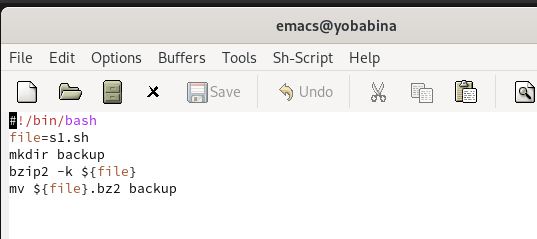
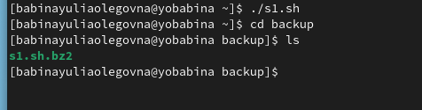
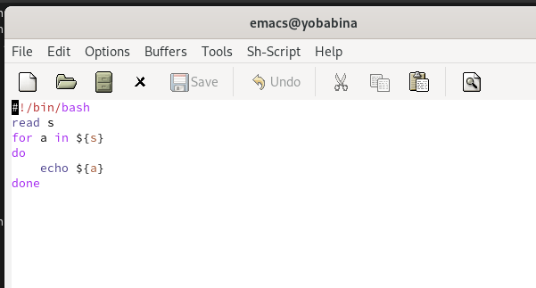
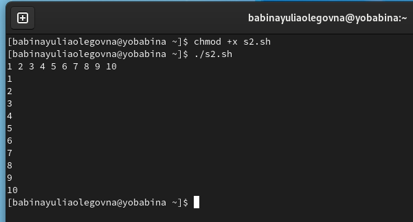
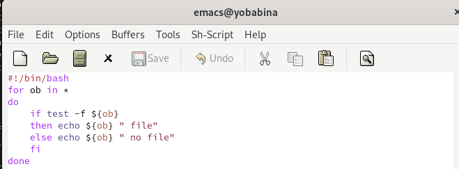
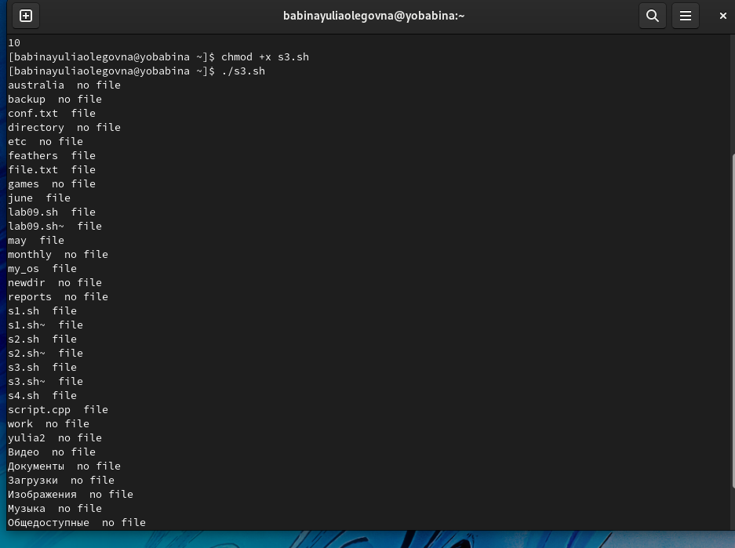
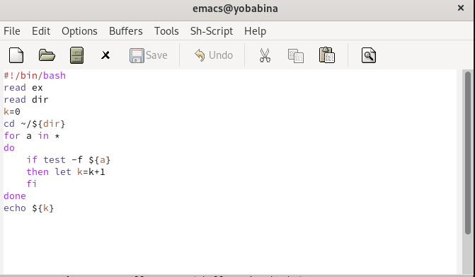
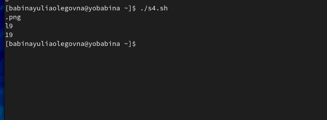

---
## Front matter
lang: ru-RU
title: Презентация к лабораторной работе №10
author: Бабина Ю.О.
group: НПМбд-01-21

## Formatting
toc: false
slide_level: 2
theme: metropolis
header-includes: 
 - \metroset{progressbar=frametitle,sectionpage=progressbar,numbering=fraction}
 - '\makeatletter'
 - '\beamer@ignorenonframefalse'
 - '\makeatother'
aspectratio: 43
section-titles: true
---

# Цель работы 

Изучить основы программирования в оболочке ОС UNIX/Linux. Научиться писать
небольшие командные файлы.

# Ход работы

## Первый скрипт 

## Второй скрипт

## Третий скрипт

## Четвертый скрипт

# Вывод
В ходе данной лабораторной работы я изучила основы программирования в оболочке ОС UNIX/Linux. Научилась писать
небольшие командные файлы.