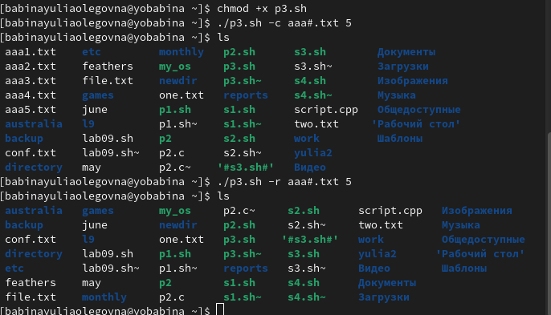

---
## Front matter
lang: ru-RU
title: Презентация к лабораторной работе №11
author: Бабина Ю.О.
group: НПМбд-01-21

## Formatting
toc: false
slide_level: 2
theme: metropolis
header-includes: 
 - \metroset{progressbar=frametitle,sectionpage=progressbar,numbering=fraction}
 - '\makeatletter'
 - '\beamer@ignorenonframefalse'
 - '\makeatother'
aspectratio: 43
section-titles: true
---

# Цель работы 

Изучить основы программирования в оболочке ОС UNIX. Научится писать более
сложные командные файлы с использованием логических управляющих конструкций
и циклов.

# Ход работы

## Выполнение задания 1. Поиск в указанном файле нужной строки.

## Выполнение задания 2. Вызов программы C через командный файл.

## Выполнение задания 3. Создание и удаление указанного количества файлов.

## Выполнение задания 4. Упаковка в архив файлов в указанной директории

# Вывод
В ходе данной лабораторной работы я изучила основы программирования в оболочке ОС UNIX. Научилась писать более
сложные командные файлы с использованием логических управляющих конструкций
и циклов.
