---
## Front matter
lang: ru-RU
title: Презентация к лабораторной работе №13
author: Бабина Ю.О.
group: НПМбд-01-21

## Formatting
toc: false
slide_level: 2
theme: metropolis
header-includes: 
 - \metroset{progressbar=frametitle,sectionpage=progressbar,numbering=fraction}
 - '\makeatletter'
 - '\beamer@ignorenonframefalse'
 - '\makeatother'
aspectratio: 43
section-titles: true
---

# Цель работы 

Приобрести простейшие навыки разработки, анализа, тестирования и отладки приложений в ОС типа UNIX/Linux на примере создания на языке программирования
С калькулятора с простейшими функциями.

# Ход работы

## Создание каталога и файла

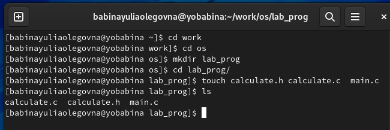

## Компиляция программы посредством gcc:

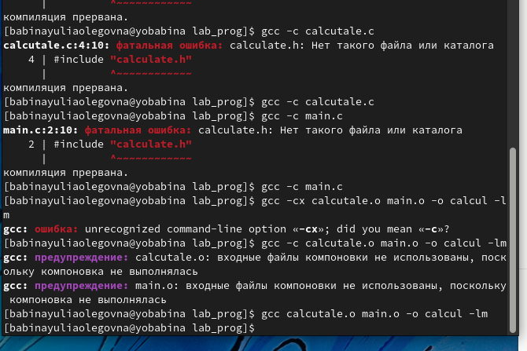

## Пересборка проекта при помощи Makefike

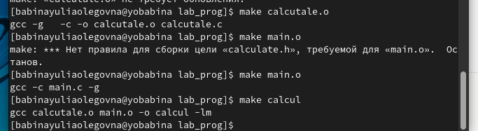

## Отладка

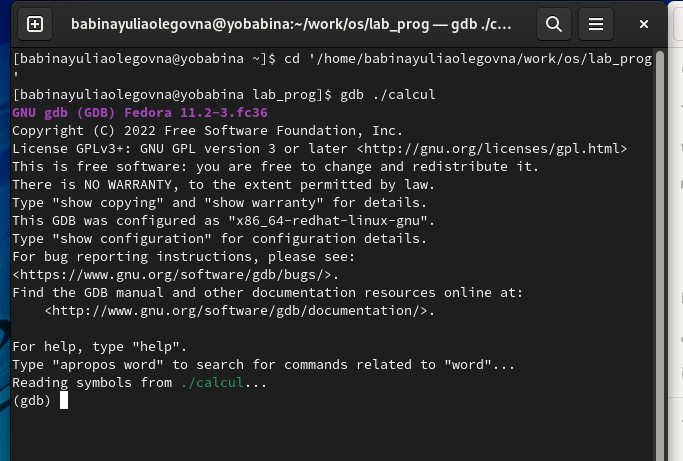

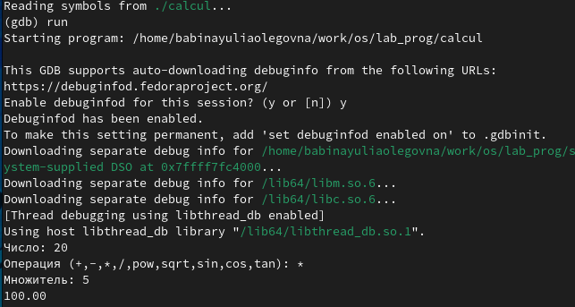

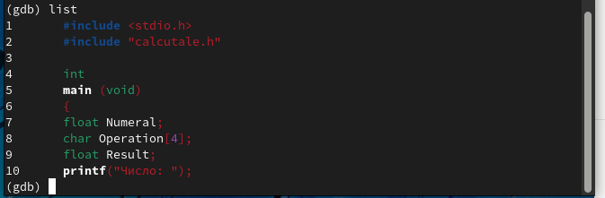

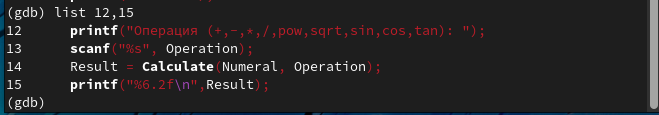

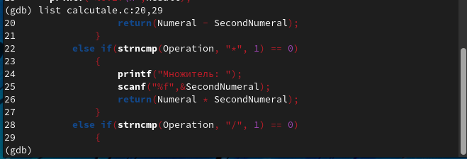

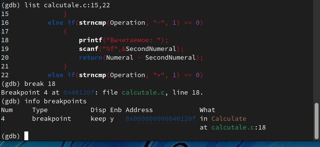

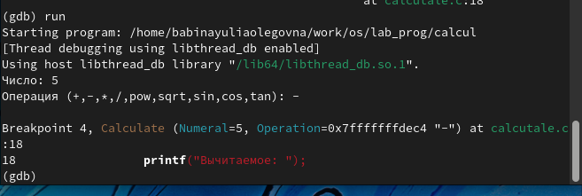

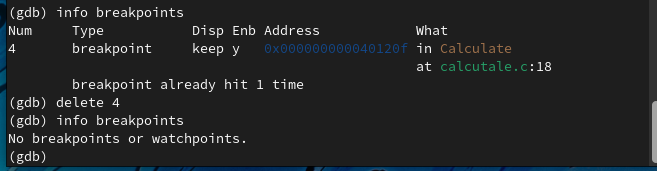

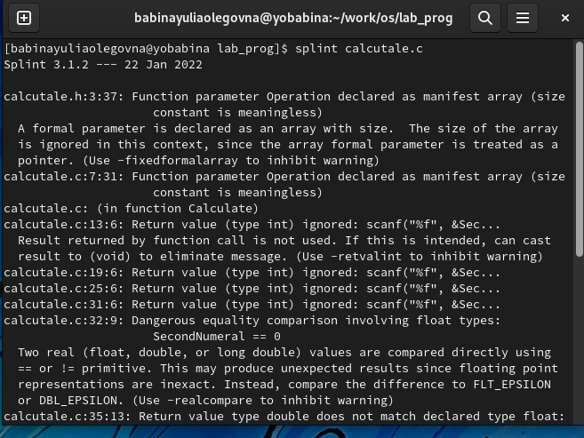

## Утилита splint 

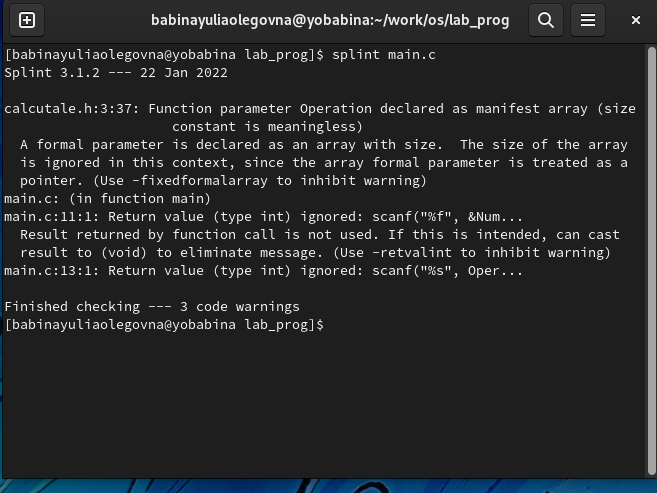

# Вывод
В ходе данной лабораторной работы я приобрела простейшие навыки разработки, анализа, тестирования и отладки приложений в ОС типа UNIX/Linux на примере создания на языке программирования
С калькулятора с простейшими функциями.