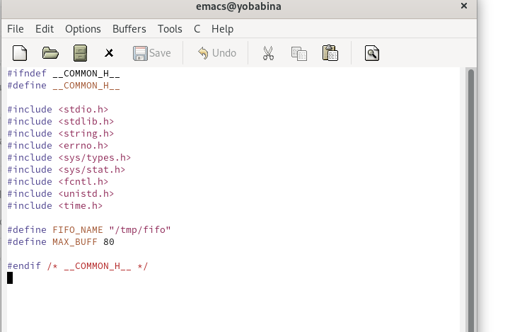
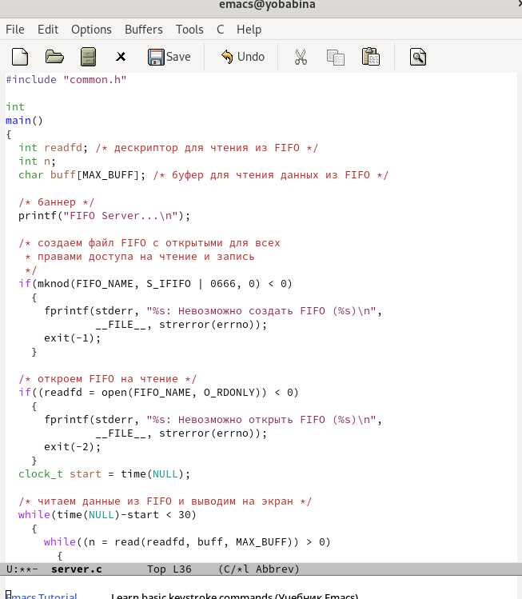
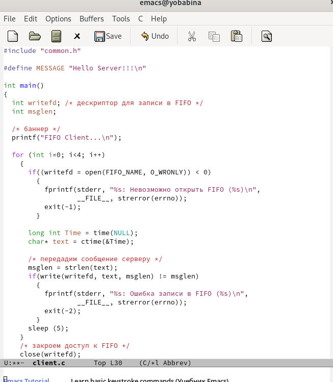
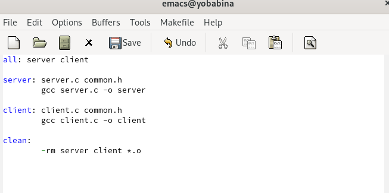
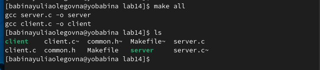
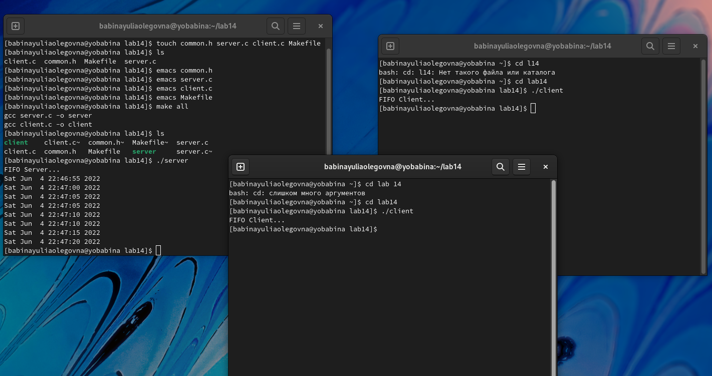

---
## Front matter
lang: ru-RU
title: Презентация к лабораторной работе №14
author: Бабина Ю.О.
group: НПМбд-01-21

## Formatting
toc: false
slide_level: 2
theme: metropolis
header-includes: 
 - \metroset{progressbar=frametitle,sectionpage=progressbar,numbering=fraction}
 - '\makeatletter'
 - '\beamer@ignorenonframefalse'
 - '\makeatother'
aspectratio: 43
section-titles: true
---

# Цель работы 

Приобретение практических навыков работы с именованными каналами.

# Ход работы

## Файл common.h

## Файл server.c

## Файл client.c

## Makefile

## Сборка проекта и проверка работы 

# Вывод
В ходе данной лабораторной работы я приобрела практические навыки работы с именованными каналами.