# **Отчет к лабораторной работе №2**
## **Common information**
discipline: Операционные системы  
author: Бабина Юлия Олеговна  
group: НПМбд-01-21
---
---
---
## **Цель работы**
Изучить идеологию и применение средств контроля версий. Освоить умения по работе с git.  
## **Ход работы**  
Создаем учетную запись на https://github.com.


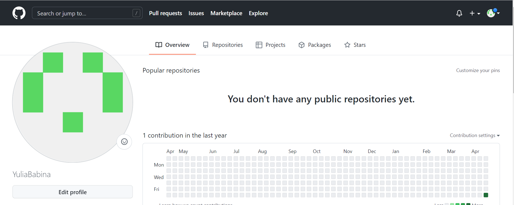

Установим git-flow в Fedora Linux при помощи терминала данных команд:
```
cd /tmp 
wget --no-check-certificate -q https://raw.github.com/petervanderdoes  ↪ ↪/gitflow/develop/contrib/gitflow-installer.sh 
chmod +x gitflow-installer.sh
sudo ./gitflow-installer.sh install stable
```

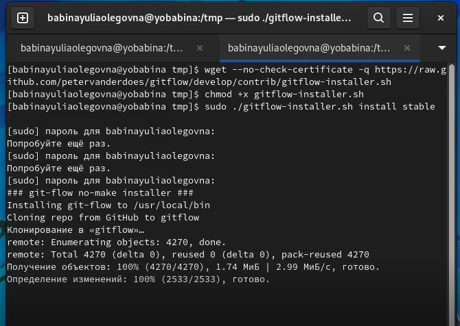

Синхронизируем учётную запись github с компьютером:
```
git config --global user.name "YuliaBabina"
git config --global user.email "iuliiare03@gmail.com"
```

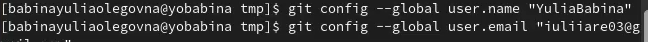

Произведем другие базовые настройки:
- Настроим utf-8 в выводе сообщений git
- Настроим верификацию и подписание коммитов git
- Зададим имя начальной ветки (будем называть её master)
- Параметр autocrlf
- Параметр safecrlf

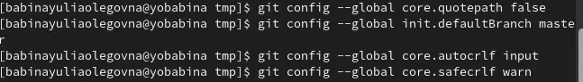

Создадим ключ ssh.

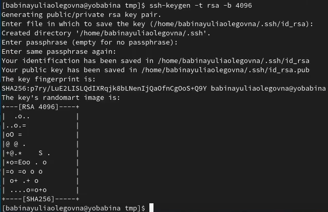

После этого скопируем ключ в буфер обмена, с помощью команды
```
 cat ~/.ssh/id_rsa.pub | xclip -sel clip.
 ```
  Добавляем его в поле “SSH Keys” в разделе “Settings” → SSH and GPG Keys. 

 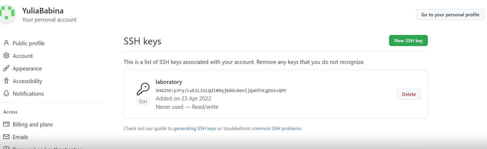

 Создадим ключ gpg.

 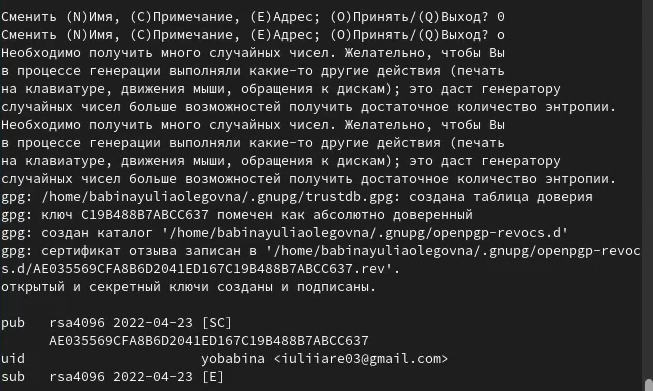

 Далее воспользуемся командой 
 ``` gpg2 --list-keys --keyid-format LONG```, чтобы перечислить длинную форму ключей gpg, для которых есть открытый и закрытый доступ.

 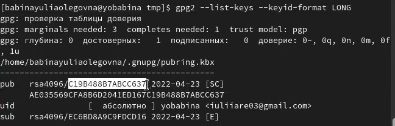

 Воспользуемся командой 
 ```gpg –amor –export C19B488B7ABCC637 | xclip –sel clip``` , чтобы скопировать ключ в буфер обмена.

 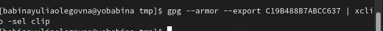 

 Добавим ключ в поле “GPG Keys” в раздеде “Settings” → “SSH and GPG Keys”.

 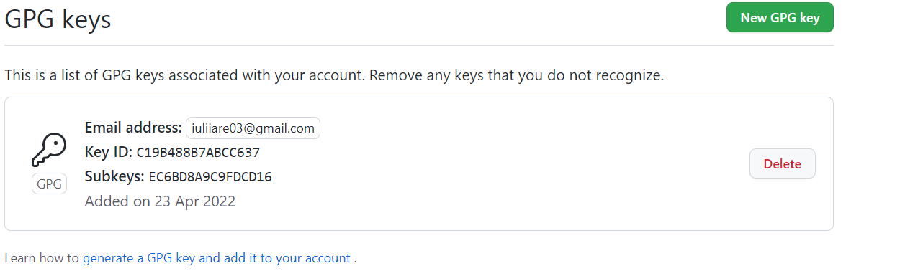 


 Настроим автоматические подписи коммитов git.
 
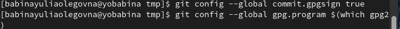 

Произведем авторизацию и настройку gh.

 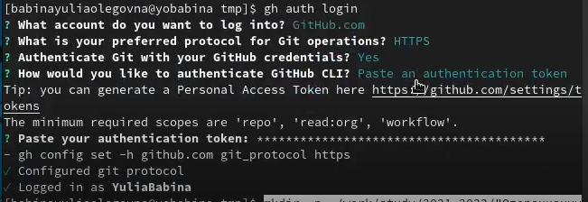 

 Создадим папку для локального репозитория, после чего скопируем шаблон в глобальный репозиторий, а из глобального скопируем в локальный.

 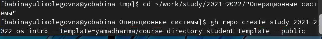

 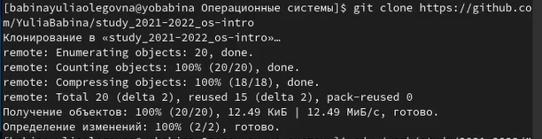 


В локальном репозитории создадим удалим файл с расширением json и создадим новый каталог.

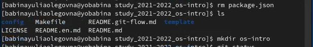 

Далее добавим файлы в фазу сохранения(git add . ), произведем сохранение (git commit – am “message”) и отправим версию в глобальный репозиторий(git push).


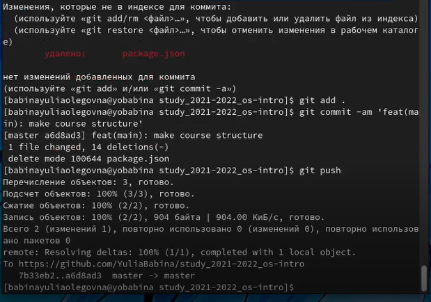 

## **Контрольные вопросы**
### *Вопрос 1*

Система контроля версий Git реализована в виде набора программ командной строки. Команды имеют следующий синтаксис: git <опция>. Системы контроля версий (VCS) применяются во время работы нескольких человек над одним проектом.

### *Вопрос 2*

Хранилище – сервер, куда пользователь размещает новую версию проекта. При этом предыдущие версии не удаляются из центрального хранилища; к ним можно вернуться в любой момент. Сервер сохраняет только изменения между последовательными версиями, что позволяет уменьшить объём хранимых данных.
Коммит – команда сохранения определенной версии в локальном репозитории в рамках системы управления версиями Git.
История версии содержит информацию об изменениях и служебную информацию.
Рабочая копия - созданная клиентской программой локальная копия части данных из хранилища.

### *Вопрос 3*

В основе централизованных систем лежит архитектура клиент / сервер, где один или несколько клиентских узлов напрямую подключены к центральному серверу.(Wikipedia)
В децентрализованных системах каждый узел принимает свое собственное решение. Конечное поведение системы является совокупностью решений отдельных узлов. (Bitcoin)

### *Вопрос 4*

Создадим локальный репозиторий. Сначала сделаем предварительную конфигурацию, указав имя и email владельца репозитория:
```
git config --global user.name"Имя Фамилия"
git config --global user.email"work@mail" 
```
и настроив utf-8 в выводе сообщений git:
```
git config --global quotepath false
```
Для инициализации локального репозитория, расположенного, например, в каталоге ~/tutorial, необходимо ввести в командной строке:  
cd  
mkdir tutorial  
cd tutorial  
git init

### *Вопрос 5*

Для последующей идентификации пользователя на сервере репозиториев необходимо сгенерировать пару ключей (приватный и открытый):
```
ssh-keygen -C"Имя Фамилия <work@mail>"
```
Ключи сохраняться в каталоге~/.ssh/.
Скопировав из локальной консоли ключ в буфер обмена
```
cat ~/.ssh/id_rsa.pub | xclip -sel clip 
``` 
вставляем ключ в появившееся на сайте поле.
Кроме этого, для отправки изменений на сервер используется команда git push.


### *Вопрос 6*

В рамках Git решаются две основные задачи: первая — хранить информацию о всех изменениях в вашем коде, начиная с самой первой строчки, а вторая — обеспечение удобства командной работы над кодом.

### *Вопрос 7*

Основные команды git:  
Наиболее часто используемые команды git: – создание основного дерева репозитория :git init–получение обновлений (изменений) текущего дерева из центрального репозитория: git pull–отправка всех произведённых изменений локального дерева в центральный репозиторий:git push–просмотр списка изменённых файлов в текущей директории: git status–просмотр текущих изменения: git diff–сохранение текущих изменений:–добавить все изменённые и/или созданные файлы и/или каталоги: git add .–добавить конкретные изменённые и/или созданные файлы и/или каталоги: git add имена_файлов – удалить файл и/или каталог из индекса репозитория (при этом файл и/или каталог остаётся в локальной директории): git rm имена_файлов – сохранение добавленных изменений: – сохранить все добавленные изменения и все изменённые файлы: git commit -am 'Описание коммита'–сохранить добавленные изменения с внесением комментария через встроенный редактор: git commit–создание новой ветки, базирующейся на текущей: git checkout -b имя_ветки–переключение на некоторую ветку: git checkout имя_ветки (при переключении на ветку, которой ещё нет в локальном репозитории, она будет создана и связана с удалённой) – отправка изменений конкретной ветки в центральный репозиторий: git push origin имя_ветки–слияние ветки стекущим деревом:git merge --no-ff имя_ветки–удаление ветки: – удаление локальной уже слитой с основным деревом ветки:git branch -d имя_ветки–принудительное удаление локальной ветки: git branch -D имя_ветки–удаление ветки с центрального репозитория: git push origin :имя_ветки.

### *Вопрос 8*

Использования git при работе с локальными репозиториями (добавления текстового документа в локальный репозиторий):
git add hello.txt
git commit -am 'Новый файл’

### *Вопрос 9*

Проблемы, которые решают ветки git:  
•	нужно постоянно создавать архивы с рабочим кодом  
•	сложно "переключаться" между архивами  
•	сложно перетаскивать изменения между архивами  
•	легко что-то напутать или потерять

### *Вопрос 10*

Во время работы над проектом так или иначе могут создаваться файлы, которые не требуется добавлять в последствии в репозиторий. Например, временные файлы, создаваемые редакторами, или объектные файлы, создаваемые компиляторами. Можно прописать шаблоны игнорируемых при добавлении в репозиторий типов файлов в файл.gitignore с помощью сервисов. Для этого сначала нужно получить списки меняющихся шаблонов: 
```
curl -L -s https://www.gitignore.io/api/list
```
Затем скачать шаблон, например, для C и C++
```
curl -L -s https://www.gitignore.io/api/c >> .gitignore
curl -L -s https://www.gitignore.io/api/c++ >> .gitignore
```

## **Вывод**
В ходе данной лабораторной работы я изучила идеологию и применение средств контроля версий. Освоила умения по работе с git.
 
