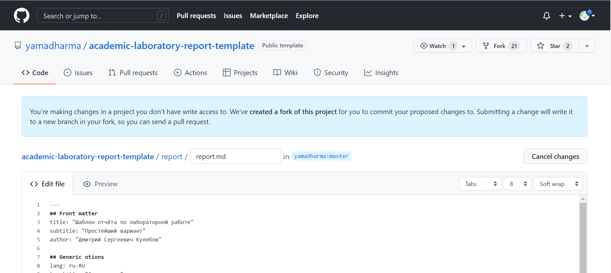
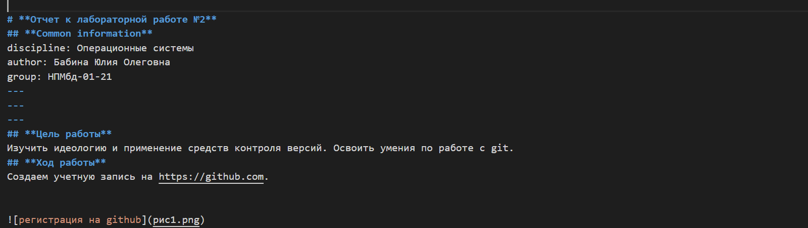
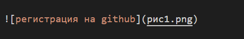
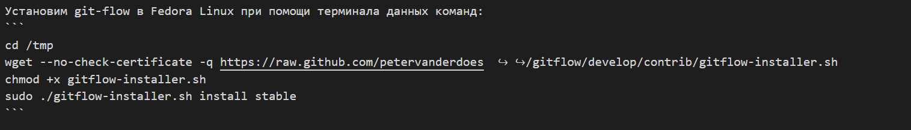
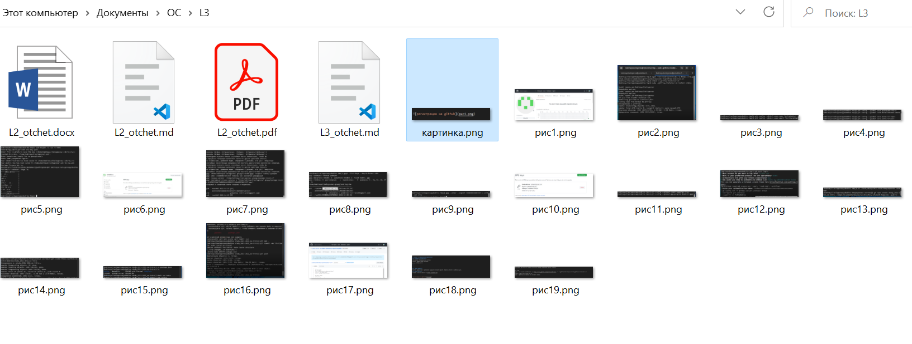

# **Отчет к лабораторной работе №3**
## **Common information**
discipline: Операционные системы  
author: Бабина Юлия Олеговна  
group: НПМбд-01-21
---
---
---
## **Цель работы**

Научиться оформлять отчёты с помощью легковесного языка разметки Markdown.

## **Ход работы**

Создаем файл с разрешением md, откроем его(я буду использовать Visual Studio Code). Далее скопируем шаблонную разметку по ссылке https://github.com/yamadharma/academic-laboratory-report-template/edit/master/report/report.md




Создадим подобие титульного листа и обозначим цель работы.




Добавим первый скрин. Данный тег имеет следующий синтаксис:
```

```

Для корректных отображений на Github и конвертации создадим папку, в которую мы сохраним md файл и все локальные фотографии.




Также используем тег для работы с кодом.



Далее отчет будет иметь аналогичную структуру.

После работы с md конвертируем файл в docx при помощи команды 

```
pandoc <имя md файла> -o <имя и расширение нового файла>
```
Далее после просмотра и редактирования docx  файла конвертируем его в pdf аналогичным или любым другим способом.

По окончании работы папка с отчетом содержит md, docx и pdf файлы и необходимые скрины.



## **Вывод**
В ходе данной лабораторной работы я научилась оформлять отчёты с помощью легковесного языка разметки Markdown.
