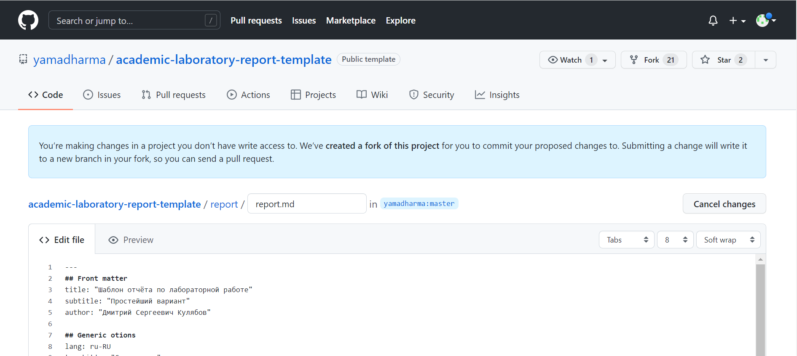
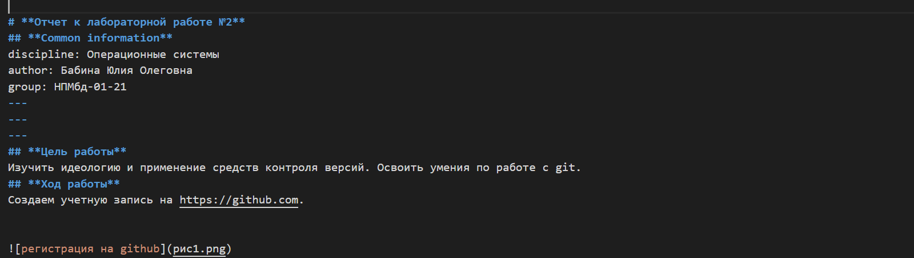
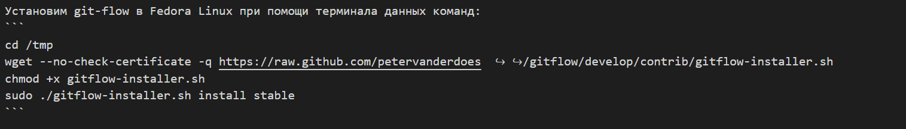

---
## Front matter
lang: ru-RU
title: Презентация к лабораторной работе №3
author: Бабина Ю.О.
group: НПМбд-01-21

## Formatting
toc: false
slide_level: 2
theme: metropolis
header-includes: 
 - \metroset{progressbar=frametitle,sectionpage=progressbar,numbering=fraction}
 - '\makeatletter'
 - '\beamer@ignorenonframefalse'
 - '\makeatother'
aspectratio: 43
section-titles: true
---

# Цель работы 

Научиться оформлять отчёты с помощью легковесного языка разметки Markdown.

# Ход работы

## Стартовая работа с файлом (создание, копирование шаблонной разметки)



## Начало редактирования шаблона



## Работа с локальным изображением 

```

```


## Работа с кодом 



## Конвертация файлов

```
pandoc <имя md файла> -o <имя и расширение нового файла>
```

## Папка после выполнения 


# Вывод
В ходе данной лабораторной работы я научилась оформлять отчёты с помощью легковесного языка разметки Markdown.
