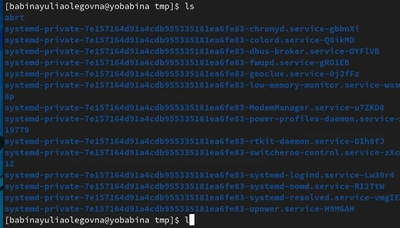
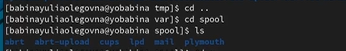
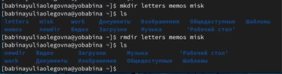
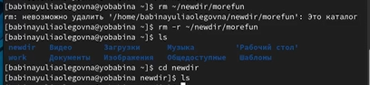
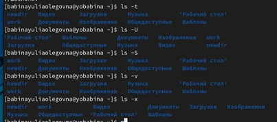
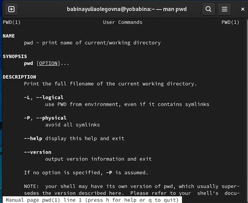
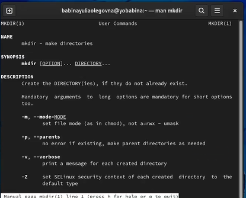

# **Отчет к лабораторной работе №4**
## **Common information**
discipline: Операционные системы  
author: Бабина Юлия Олеговна  
group: НПМбд-01-21
---
---
---
## **Цель работы**
Приобретение практических навыков взаимодействия пользователя с системой посредством командной строки. 
## **Ход работы**  
Определите полное имя нашего домашнего каталога, используя команду pwd (рис.1).


В домашнем каталоге перейдем в папку tmp с помощью команды cd /var/tmp (рис.2).


Выведем на экран содержимое каталога /tmp. (команда ls с различными опциями) (рис.3)




В первый раз, когды мы выводили команду ls терминал вывел нам только список каталогов и файлов, которые хранятся в папке tmp. Во второй раз при вводе команды ls -alF терминал вывел не только название папок, но и права доступа, дату последнего изменения, владельцев папок, число ссылок. С помощью уоманды ls -a можно посмотреть скрытые папки (рис.4). Разница между выводимой информацией объясняется тем, что мы используем различные команды ls.


Теперь определим, есть ли в каталоге /var/spool подкаталог с именем cron(рис.5). Для этого сначала перейдем на уровень вверх,используя команду cd .., командой cd spool попадем в нужный нам каталог и с помощью команды ls увидим, что подкаталога cron в данной директории нет.



Вернемся в наш домашний каталог, используя команду cd ~ и узнаем, кто является владельцем файлов и каталогов с помощью команды ls -l (рис.6).


Как мы видим из результатов работы терминала, все папки и файлы в домашнем каталоге принадлежат пользователю babinayuliaolegovna. 

В домашнем каталоге создадим новый каталог с именем newdir и в нём же новый каталог morefun (рис.7)


В домашнем каталоге создадим одной командой три новых каталога с именами
letters, memos, misk.(рис.8).Затем удалим эти каталоги одной командой rmdir.



Попробуем удалить ранее созданный каталог ~/newdir командой rm (рис.9). У нас это не получится, терминал выдает ошибку, так как это каталог, а не файл. Чтобы это сделать, нужно использовать опции команды rm.


Удалим каталог ~/newdir/morefun из домашнего каталога (рис.10). Сначала попробуем сделать с помощью команды rm ~/newdir/morefun. Терминал выдаст ошибку. Добавим опцию -r  и увидим, что каталог удалился. 



С помощью команды man ls определим, какую опцию команды ls нужно использовать для просмотра содержимое не только указанного каталога, но и подкаталогов,
входящих в него. Это комагда ls -R (рис.11).


С помощью команды man определите набор опций команды ls, позволяющий отсортировать по времени последнего изменения выводимый список содержимого каталога с развёрнутым описанием файлов(рис.12).



Используя команду man (рис.13), чтобы посмотреть описания команд cd (рис.14), pwd (рис.15), mkdir (рис.16), rmdir (рис.17), rm(рис.18).








Команда cd предназначена для перемещения по файловой системе операционной системы Linux. Для определения абсолютного пути к текущему каталогу используется команда pwd. Команда mkdir используется для создания каталогов. Команда rm используется для удаления файлов и/ или каталогов. Для удаления каталогов используют опцию команды -r. Команда rmdir нужна, чтобы удалять пустые каталоги, если каталог не пуст, система выдаст ошибку.

Используя информацию, полученную при помощи команды history, выполним модификацию и исполнение нескольких команд из буфера команд(рис.19)


## **Контрольные вопросы**
### *Вопрос 1*

Командная строка представляет собой программное средство ввода команд пользователем и получения результатов их выполнения на экране.

### *Вопрос 2*

Определить абсолютный путь текущего каталога можно при помощи команды pwd:  
pwd   
/afs/dk.sci.pfu.edu.ru/home/d/h/dharma

### *Вопрос 3*

Определить только тип файлов и их имена в текущем каталоге можно с помощью команд ls и ls -a.

### *Вопрос 4*

Информацию о скрытых файлах можно отобразить при помощи команды ls -a. Такие файлы обычно используются для настройки рабочей среды.

### *Вопрос 5*

Удалить файл можно при помощи команды rm, каталог - при помощи rmdir. Также можно удалять несколько файлов и каталогов одной командой, указывая имя файлов через пробел.  
rmdir l1 l2 l3    
rm f1.txt f2.txt


### *Вопрос 6*

Вывести информацию о последних выполненных пользователем командах можно при помощи команды history.

### *Вопрос 7*

Модификация команд имеет следующий синтаксис:  
!<номер_команды>:s/<что_меняем>/<на_что_меняем>  
!3:s/a/F   
ls -F

### *Вопрос 8*

Если требуется выполнить последовательно несколько команд, записанный в одной строке, то для этого используется символ точка с запятой:  
cd; ls

### *Вопрос 9*

Экранирование – это способ заключения в кавычки одиночного символа. Экранирующий (escape) символ (```\```) сообщает интерпретатору, что следующий за ним символ не должен восприниматься как обычный символ. Примеры специальных символов: . / *. 
### *Вопрос 10*

При использовании команды ls -l для каждой директории выведется подробный список, в котором будет отображаться владелец, группа, дата создания, размер и другие параметры. 

### *Вопрос 11*

Относительный путь представляет собой путь по отношению к текущему рабочему каталогу пользователя или активных приложений.  
cd ~\Desktop   
cd Desktop  
В результате выполнение обеих команд мы перейдем в директорию Desktop.

### *Вопрос 12*

Команда man используется для просмотра (оперативная помощь) в диалоговом режиме руководства (manual) по основным командам операционной системы типа Linux.

### *Вопрос 13*

Клавиша TAB служит для автоматического дополнения вводимых команд.


## **Вывод**
В ходе данной лабораторной работы я приобрела практические навыки взаимодействия пользователя с системой посредством командной строки. 
 
