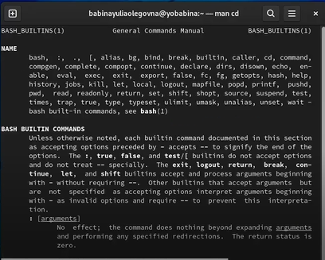

---
## Front matter
lang: ru-RU
title: Презентация к лабораторной работе №4
author: Бабина Ю.О.
group: НПМбд-01-21

## Formatting
toc: false
slide_level: 2
theme: metropolis
header-includes: 
 - \metroset{progressbar=frametitle,sectionpage=progressbar,numbering=fraction}
 - '\makeatletter'
 - '\beamer@ignorenonframefalse'
 - '\makeatother'
aspectratio: 43
section-titles: true
---

# Цель работы 

Приобретение практических навыков взаимодействия пользователя с системой посредством командной строки.

# Ход работы

## Выполнение пункта 1 (путь домашнего каталога)

## Выполнение пункта 2(работа с каталогами tmp, var и домашним)

## Выполнение пункта 3 (создание и удаление каталогов)

##  Выполнение пункта 4 (работа с командой man)

## Выполнение пункта 5 (работа с командой man)

## Выполнение пункта 6 (работа с командой man)

## Выполнение пункта 7 (работа с командой history)

# Вывод
В ходе данной лабораторной работы я приобрела практические навыки взаимодействия пользователя с системой посредством командной строки.
