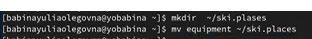
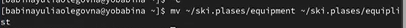
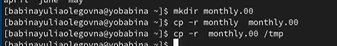
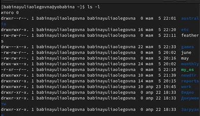
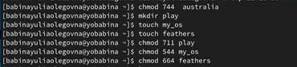
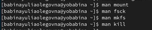

---
## Front matter
lang: ru-RU
title: Презентация к лабораторной работе №5
author: Бабина Ю.О.
group: НПМбд-01-21

## Formatting
toc: false
slide_level: 2
theme: metropolis
header-includes: 
 - \metroset{progressbar=frametitle,sectionpage=progressbar,numbering=fraction}
 - '\makeatletter'
 - '\beamer@ignorenonframefalse'
 - '\makeatother'
aspectratio: 43
section-titles: true
---

# Цель работы 

Ознакомление с файловой системой Linux, её структурой, именами и содержанием
каталогов. Приобретение практических навыков по применению команд для работы
с файлами и каталогами, по управлению процессами (и работами), по проверке использования диска и обслуживанию файловой системы.

# Ход работы

## Выполнение примеров из описания лабораторной работы, команда mv

При помощи команды mv можно переместить файлы в другой каталог или изменить их название.

## Выполнение примеров предназначения для копирования файлов и каталогов

Эта команда предназначена для копирования файлов и каталогов.

## Изменение прав доступа

Для того, чтобы просмотреть текущие права доступа к файлам можно ввести команду ls-l.

Для того, чтобы поменять права доступа, можно воспользоваться командой chmod. Формат команды: chmod режим имя_файла

## Файловая сиситема (работа с командой man)
Команда mount выводит информацию о файловой системе. Команда fsck позволяет проверить целостность системы файлов. Команда kill может прекратить процесс, который в настоящее вркмя исполняется.

# Вывод
В ходе данной лабораторной работы я ознакомилась с файловой системой Linux, её структурой, именами и содержанием
каталогов. Приобрела практические навыки по применению команд для работы
с файлами и каталогами, по управлению процессами (и работами), по проверке использования диска и обслуживанию файловой системы.
