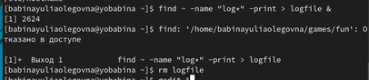
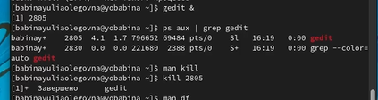

# **Отчет к лабораторной работе №6**
## **Common information**
discipline: Операционные системы  
author: Бабина Юлия Олеговна  
group: НПМбд-01-21
---
---
---
## **Цель работы**
Ознакомление с инструментами поиска файлов и фильтрации текстовых данных.
Приобретение практических навыков: по управлению процессами (и заданиями), по
проверке использования диска и обслуживанию файловых систем.

## **Ход работы**  
Осуществим вход в систему, используя соответствующее имя пользователя и пароль. 

Запишем в файл file.txt названия файлов, содержащихся в каталоге /etc. Допишем  в этот же файл названия файлов, содержащихся в нашем домашнем каталоге.(рис.1)

Выведем  имена всех файлов из file.txt, имеющих расширение .conf, после чего
запишем их в новый текстовой файл conf.txt. (рис.2)

Определим, какие файлы в нашем домашнем каталоге имеют имена, начинавшиесяс символа c (рис.3).

Выведем на экран (по странично) имена файлов из каталога /etc, начинающиеся с символа h (рис.4).

Запустим в фоновом режиме процесс, который будет записывать в файл ~/logfile файлы, имена которых начинаются с log.
Далее удалим файл ~/logfile (рис.5).

Запустим из консоли в фоновом режиме редактор gedit.
 Определим идентификатор процесса gedit, используя команду ps, конвейер и фильтр grep. Далее прочтем справку (man) команды kill и завершим процесс gedit (рис.6).

Выполним команды df и du, предварительно получив более подробную информацию об этих командах, с помощью команды man (рис.7).

Воспользовавшись справкой команды find, выведем имена всех директорий, имеющихся в нашем домашнем каталоге (рис.8).

## **Контрольные вопросы**
### *Вопрос 1*

В системе по умолчанию открыто три специальных потока: 
- stdin − стандартный поток ввода (по умолчанию: клавиатура), файловый дескриптор 0;
- stdout − стандартный поток вывода (по умолчанию: консоль), файловый дескриптор 1;
- stderr − стандартный поток вывод сообщений об ошибках (по умолчанию: консоль), файловый дескриптор 2. 
Большинство используемых в консоли команд и программ записывают результаты своей работы в стандартный поток вывода stdout.

### *Вопрос 2*

">" Перенаправление вывода в файл  
">>" Перенаправление вывода в файл и открытие файла в режиме добавления (данные добавляются в конец файла).

### *Вопрос 3*

 Конвейер (pipe) служит для объединения простых команд или утилит в цепочки, в которых результат работы предыдущей команды передаётся последующей.  
Синтаксис следующий:  
команда 1 | команда 2 (это означает, что вывод команды 1 передастся на ввод команде 2)

### *Вопрос 4*

Процесс рассматривается операционной системой как заявка на потребление всех видов ресурсов, кроме одного − процессорного времени.  
Этот последний важнейший ресурс распределяется операционной системой между другими единицами работы − потоками, которые и получили свое название благодаря тому, что они представляют собой последовательности (потоки выполнения) команд.  
Процесс − это выполнение программы. Он считается активной сущностью и реализует действия, указанные в программе.  
Программа представляет собой статический набор команд, а процесс - это набор ресурсов и данных, использующихся при выполнении программы.

### *Вопрос 5*

pid: идентификатор процесса (PID) процесса (process ID), к которому вызывают метод  
gid: идентификатор группы UNIX, в котором работает программа.

### *Вопрос 6*

 Любую выполняющуюся в консоли команду или внешнюю программу можно запустить в фоновом режиме. Для этого следует в конце имени команды указать знак амперсанда &.  
Запущенные фоном программы называются задачами (jobs). Ими можно управлять с помощью команды jobs, которая выводит список запущенных в данный момент задач.

### *Вопрос 7*

 top − это консольная программа, которая показывает список работающих процессов в системе. Программа в реальном времени отсортирует запущенные процессы по их нагрузке на процессор.  
htop − это продвинутый консольный мониторинг процессов. Утилита выводит постоянно меняющийся список системных процессов, который сортируется в зависимости от нагрузки на ЦПУ. Если делать сравнение с top, то htop показывает абсолютно все процессы в системе, время их непрерывного использования, загрузку процессоров и расход оперативной памяти.

### *Вопрос 8*

сход оперативной памяти.
8. find − это команда для поиска файлов и каталогов на основе специальных условий. Ее можно использовать в различных обстоятельствах, например, для поиска файлов по разрешениям, владельцам, группам, типу, размеру и другим подобным критериям.  
Команда find имеет такой синтаксис:  
find папка параметры критерий шаблон действие  
Папка − каталог в котором будем искать.  
Параметры − дополнительные параметры, например, глубина поиска, и т.д.  
Критерий − по какому критерию будем искать: имя, дата создания, права, владелец и т.д.  
Шаблон – непосредственно значение по которому будем отбирать файлы.  
Основные параметры:
- -P никогда не открывать символические ссылки
- -L - получает информацию о файлах по символическим ссылкам. Важно для дальнейшей обработки, чтобы обрабатывалась не ссылка, а сам файл
- -maxdepth - максимальная глубина поиска по подкаталогам, для поиска только в текущем каталоге установите 1
- -depth - искать сначала в текущем каталоге, а потом в подкаталогах
- -mount искать файлы только в этой файловой системе
- -version - показать версию утилиты find
- -print - выводить полные имена файлов
- -type f - искать только файлы
- -type d - поиск папки в Linux  
Основные критерии:
- -name - поиск файлов по имени
- -perm - поиск файлов в Linux по режиму доступа
- -user - поиск файлов по владельцу
- -group - поиск по группе
- -mtime - поиск по времени модификации файла
- -atime - поиск файлов по дате последнего чтения
- -nogroup - поиск файлов, не принадлежащих ни одной группе
- -nouser - поиск файлов без владельцев
- -newer - найти файлы новее чем указанный
- -size - поиск файлов в Linux по их размеру  
Примеры:  
find ~ -type d поиск директорий в домашнем каталоге  
find ~ -type f -name ".*" поиск скрытых файлов в домашнем каталоге

### *Вопрос 9*

Файл по его содержимому можно найти с помощью команды grep: «grep -r "слово/выражение, которое нужно найти"».

### *Вопрос 10*

Утилита df, позволяет проанализировать свободное пространство на всех подключенных к системе разделах.

### *Вопрос 11*

При выполнении команды du (без указания папки и опции) можно получить все файлы и папки текущей директории с их размерами. Для домашнего каталога: du ~/

### *Вопрос 12*

Основные сигналы (каждый сигнал имеет свой номер), которые используются для завершения процесса:
- SIGINT – самый безобидный сигнал завершения, означает Interrupt. Он отправляется процессу, запущенному из терминала с помощью сочетания клавиш Ctrl+C. Процесс правильно завершает все свои действия и возвращает управление;
- SIGQUIT – это еще один сигнал, который отправляется с помощью сочетания клавиш, программе, запущенной в терминале. Он сообщает ей, что нужно завершиться и программа может выполнить корректное завершение или проигнорировать сигнал. В отличие от предыдущего, она генерирует дамп памяти. Сочетание клавиш Ctrl+/;
- SIGHUP – сообщает процессу, что соединение с управляющим терминалом разорвано, отправляется, в основном, системой при разрыве соединения с интернетом;
- SIGTERM – немедленно завершает процесс, но обрабатывается программой, поэтому позволяет ей завершить дочерние процессы и освободить все ресурсы;
- SIGKILL – тоже немедленно завершает процесс, но, в отличие от предыдущего варианта, он не передается самому процессу, а обрабатывается ядром. Поэтому ресурсы и дочерние процессы остаются запущенными.  
Также для передачи сигналов процессам в Linux используется утилита kill, её синтаксис: kill -сигнал pid_процесса (PID – уникальный
идентификатор процесса). Сигнал представляет собой один из выше перечисленных сигналов для завершения процесса.  
Перед тем, как выполнить остановку процесса, нужно определить его PID. Для этого используют команды ps и grep. Команда ps предназначена для вывода списка активных процессов в системе и информации о них. Команда grep запускается одновременно с ps (в канале) и будет
выполнять поиск по результатам команды ps.  
Утилита pkill – это оболочка для kill, она ведет себя точно так же, и имеет тот же синтаксис, только в качестве идентификатора процесса ей нужно передать его имя.  
killall работает аналогично двум предыдущим утилитам. Она тоже принимает имя процесса в качестве параметра и ищет его PID в директории /proc. Но эта утилита обнаружит все процессы с таким именем и завершит их.

## **Вывод**
В ходе данной лабораторной работы я ознакомилась с инструментами поиска файлов и фильтрации текстовых данных.
Приобрела практических навыки: по управлению процессами (и заданиями), по проверке использования диска и обслуживанию файловых систем.
