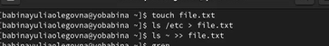
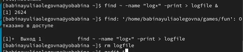
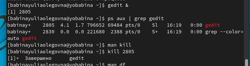
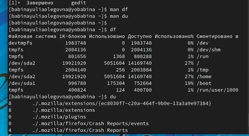
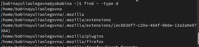

---
## Front matter
lang: ru-RU
title: Презентация к лабораторной работе №6
author: Бабина Ю.О.
group: НПМбд-01-21

## Formatting
toc: false
slide_level: 2
theme: metropolis
header-includes: 
 - \metroset{progressbar=frametitle,sectionpage=progressbar,numbering=fraction}
 - '\makeatletter'
 - '\beamer@ignorenonframefalse'
 - '\makeatother'
aspectratio: 43
section-titles: true
---

# Цель работы 
Ознакомление с инструментами поиска файлов и фильтрации текстовых данных.
Приобретение практических навыков: по управлению процессами (и заданиями), по
проверке использования диска и обслуживанию файловых систем.

# Ход работы

## Выполнение пунктов 1,2 

Осуществим вход в систему, используя соответствующее имя пользователя и пароль.

## Выполнение пункта 3

## Выполнение пункта 4

##  Выполнение пункта 5

## Выполнение пунктов 6-7

## Выполнение пунктов 8-10

## Выполнение пункта 11

## Выполнение пункта 12

# Вывод

В ходе данной лабораторной работы я ознакомилась с инструментами поиска файлов и фильтрации текстовых данных.
Приобрела практических навыки: по управлению процессами (и заданиями), по проверке использования диска и обслуживанию файловых систем.