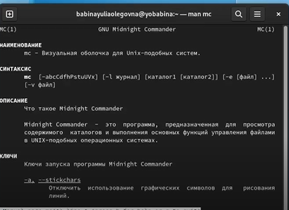
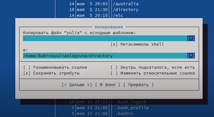
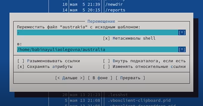
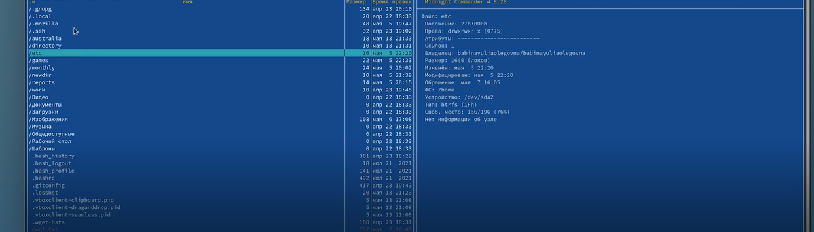
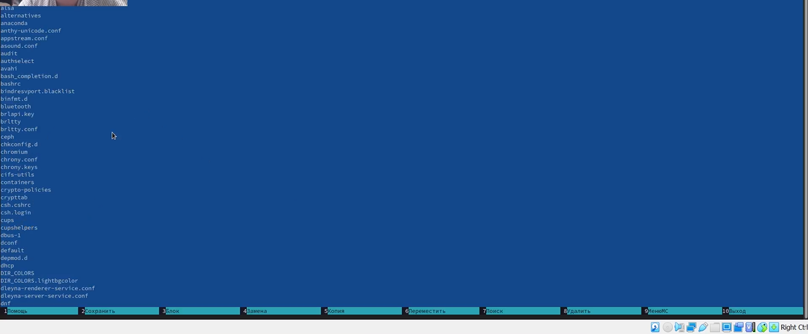
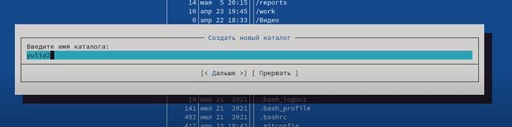
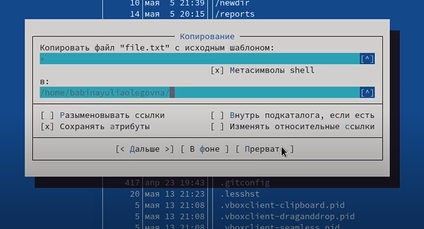
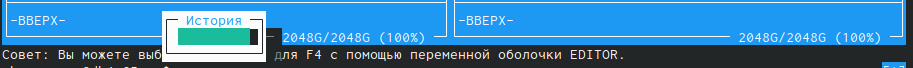
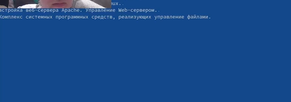
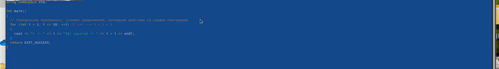

# **Отчет к лабораторной работе №7**
## **Common information**
discipline: Операционные системы  
author: Бабина Юлия Олеговна  
group: НПМбд-01-21
---
---
---
## **Цель работы**
Освоение основных возможностей командной оболочки Midnight Commander. Приобретение навыков практической работы по просмотру каталогов и файлов; манипуляций
с ними.

## **Ход работы**  
Изучим информацию о mc, вызвав в командной строке man mc.

Запустим из командной строки mc, изучим его структуру и меню.

Выполним несколько операций в mc, используя управляющие клавиши.

Выполним основные команды меню левой (или правой) панели. 

Выполним просмотр содержимого текстового файла с возможностью редактирования при помощи клавиши F4.

Отредактируем содержимое текстового файла (без сохранения результатов
редактирования).

Создадим каталог при помощи клавиши F7.

Скопируем файлы в созданный каталог.

Осуществим поиск в файловой системе файла с заданными условиями.

Просмотрим историю команд.

Просмотрим дерево каталогов и перейдем в домашний.

Произведем анализ файла меню и файла расширений.

Освоим операции, определяющие структуру экрана mc.

Выполним задание по встроенному редактору mc.

Создадим текстовой файл text.txt.
Откроем этот файл с помощью встроенного в mc редактора.
Вставим в открытый файл небольшой фрагмент текста, скопированный из любого
другого файла или Интернета.

Проделаем с текстом следующие манипуляции, используя горячие клавиши:
- Удалим строку текста клавишей F8.
- Выделим фрагмент текста и скопируйте его на новую строку клавишей F5.
- Выделим фрагмент текста и перенесите его на новую строку клавишей F6.
- Сохраним файл, при этом отменив последнее действие.
- Перейдем в конец файла и напишем некоторый
текст.
- Перейдем в начало файла и напишием некоторый
текст.
- Сохраним и закроем файл.

Откроем файл с исходным текстом на некотором языке программирования, после чего, используя меню редактора, включим и выключим подсветку синтаксиса.

## **Контрольные вопросы**
### *Вопрос 1*

Панели могут дополнительно быть переведены в один из двух режимов: «Информация» или «Дерево». В режиме «Информация» на панель выводятся сведения о файле и текущей файловой системе, расположенных на активной панели. В режиме «Дерево» на одной из панелей выводится структура дерева каталогов.

### *Вопрос 2*

Как с помощью команд shell, так и с помощью меню (комбинаций клавиш) mc можно выполнить следующие операции с файлами:

- копирование «F5» («cp имя_файла имя_каталога (в который копируем)») (Рисунок14)

- перемещение/переименование «F6» («mv имя_файла имя_каталога (в который перемещаем)»)(Рисунок15)

- создание каталога «F7» («mkdir имя_каталога»)(Рисунок38)

- удаление «F8» («rm имя_файла»)

- изменение прав доступа «ctrl+x» («chmod u+x имя_файла»)

### *Вопрос 3*

 Перейти в строку меню панелей mc можно с помощью функциональной клавиши «F9». В строке меню имеются пять меню: «Леваяпанель», «Файл», «Команда», «Настройки» и «Праваяпанель».
Под пункт меню «Быстрый просмотр» позволяет выполнить быстрый просмотр содержимого панели.

Подпункт меню «Информация» позволяет посмотреть информацию о файле или каталоге. В меню каждой (левой или правой) панели можно выбрать «Формат списка»:

- стандартный − выводит список файлов и каталогов с указанием размера и времени правки;

- ускоренный − позволяет задать число столбцов, на которые разбивается панель при выводе списка имён файлов или каталогов без дополнительной информации;

- расширенный − помимо названия файла или каталога выводит сведения о правах доступа, владельце, группе, размере, времени правки;

- определённый пользователем − позволяет вывести те сведения о файле или каталоге, которые задаст сам пользователь.

Подпункт меню «Порядок сортировки» позволяет задать критерии сортировки при выводе списка файлов и каталогов: без сортировки, по имени, расширенный, время правки, время доступа, время изменения атрибута, размер, узел.

### *Вопрос 4*

 Команды меню «Файл»:
- Просмотр(«F3»)− позволяет посмотреть содержимое текущего (или выделенного) файла без возможности редактирования.

- Просмотр вывода команды («М»+«!»)− функция запроса команды с параметрами (аргумент к текущему выбранному файлу).

- Правка(«F4») − открывает текущий (или выделенный) файл для его редактирования.

- Копирование(«F5»)− осуществляет копирование одного или нескольких файлов или каталогов в указанное пользователем во всплывающем окне место.

- Права доступа («Ctrl-x»«c»)− позволяет указать (изменить) права доступа к одному или нескольким файлам или каталогам.

- Жёсткая ссылка («Ctrl-x»«l»)− позволяет создать жёсткую ссылку к текущему(или выделенному) файлу.

- Символическая ссылка («Ctrl-x»«s»)− позволяет создать символическую ссылку к текущему (или выделенному) файлу.

- Владелец/группа («Ctrl-x»«o»)− позволяет задать (изменить) владельца и имя группы для одного или нескольких файлов или каталогов.

- Права(расширенные)− позволяет изменить права доступа и владения для одного или нескольких файлов или каталогов.

- Переименование («F6»)− позволяет переименовать (или переместить) один или несколько файлов или каталогов.

- Создание каталога («F7») − позволяет создать каталог.

- Удалить («F8») − позволяет удалить один или несколько файлов или каталогов.

- Выход («F10») − завершает работу mc.

### *Вопрос 5*

В меню Команда содержатся более общие команды для работы с mc.

Команды меню Команда:

Дерево каталогов − отображает структуру каталогов системы.

Поиск файла − выполняет поиск файлов по заданным параметрам.

Переставить панели − меняет местами левую и правую панели.

Сравнить каталоги («Ctrl-x»«d») − сравнивает содержимое двух каталогов.

Размеры каталогов − отображает размер и время изменения каталога (по умолчанию в mc размер каталога корректно не отображается).

История командной строки − выводит на экран список ранее выполненных в оболочке команд.

Каталоги быстрого доступа(Ctrl-\»)− при вызове выполняется быстрая смена текущего каталога на один из заданного списка.

Восстановление файлов − позволяет восстановить файлы на файловых системах ext2 и ext3.

Редактировать файл расширений − позволяет задать с помощью определённого синтаксиса действия при запуске файлов с определённым расширением (например, какое программное обеспечение запускать для открытия или редактирования файлов с расширением doc или docx).

Редактировать файл меню − позволяет отредактировать контекстное меню пользователя, вызываемое по клавише «F2».

Редактировать файл расцветки имён − позволяет подобрать оптимальную для пользователя расцветку имён файлов в зависимости от их типа.

### *Вопрос 6*

  Меню Настройки содержит ряд дополнительных опций по внешнему виду и функциональности mc.
Меню Настройки содержит:

Конфигурация − позволяет скорректировать настройки работы с панелями.

Внешний вид и Настройки панелей − определяет элементы (строка меню, командная строка, подсказки и прочее), отображаемые при вызове mc, а также геометрию расположения панелей и цветовыделение.

Биты символов − задаёт формат обработки информации локальным терминалом.

Подтверждение − позволяет установить или убрать вывод окна с запросом подтверждения действий при операциях удаления и перезаписи файлов, а также при выходе из программы.

Распознание клавиш − диалоговое окно используется для тестирования функциональных клавиш, клавиш управления курсором и прочее.

Виртуальные ФС − настройки виртуальной файловой системы: тайм-аут, пароль и прочее.

### *Вопрос 7*

Функциональные клавиши mc:
F1 – вызов контекстно-зависимой подсказки

F2 – вызов пользовательского меню с возможностью создания и/или дополнения дополнительных функций

F3 – просмотр содержимого файла, на который указывает подсветка в активной панели (без возможности редактирования)

F4 – вызов встроенного в mc редактора для изменения содержания файла, на который указывает подсветка в активной панели

F5 – копирование одного или нескольких файлов, отмеченных впервой (активной) панели, в каталог, отображаемый на второй панели

F6 – перенос одного или нескольких файлов, отмеченных в первой (активной) панели, в каталог, отображаемый на второй панели

F7 – создание подкаталога в каталоге, отображаемом в активной панели

F8 – удаление одного или нескольких файлов (каталогов), отмеченных в первой (активной) панели файлов

F9 – вызов меню mc

F10 – выход из mc

### *Вопрос 8*

Встроенный в mc редактор вызывается с помощью функциональной клавиши «F4». В нём удобно использовать различные комбинации клавиш при редактировании содержимого (как правило текстового) файла. Клавиши для редактирования файла:

«Ctrl-y» − удалить строку

«Ctrl-u» − отмена последней операции

«ins» - вставка/замена

«F7» − поиск (можно использовать регулярные выражения)

«↑-F7» − повтор последней операции поиска

«F4» − замена

«F3» − первое нажатие − начало выделения, второе − окончание выделения

«F5» − копировать выделенный фрагмент

«F6» − переместить выделенный фрагмент

«F8» − удалить выделенный фрагмент

«F2» − записать изменения в файл

«F10» − выйти из редактор
### *Вопрос 9*

Для редактирования меню пользователя, которое вызывается клавишей «F2», необходимо перейти в пункт «Редактировать файл меню» → «Команда» и изменить настройки файла.

### *Вопрос 10*

Часть команд «Меню пользователя», а также меню «Файл» позволяют выполнять действия, определяемые пользователем, над текущим файлом. Например, копирование каталога или файла, переименование, перемещение, архивирование.

## **Вывод**
В ходе данной лабораторной работы я освоила основные возможности командной оболочки Midnight Commander. Приобрела навыки практической работы по просмотру каталогов и файлов; манипуляций
с ними.