---
## Front matter
lang: ru-RU
title: Презентация к лабораторной работе №7
author: Бабина Ю.О.
group: НПМбд-01-21

## Formatting
toc: false
slide_level: 2
theme: metropolis
header-includes: 
 - \metroset{progressbar=frametitle,sectionpage=progressbar,numbering=fraction}
 - '\makeatletter'
 - '\beamer@ignorenonframefalse'
 - '\makeatother'
aspectratio: 43
section-titles: true
---

# Цель работы 
Освоение основных возможностей командной оболочки Midnight Commander. Приобретение навыков практической работы по просмотру каталогов и файлов; манипуляций
с ними.

# Ход работы

## Информация о mc

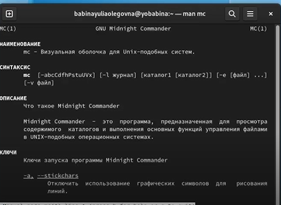

## Изучение меню mc

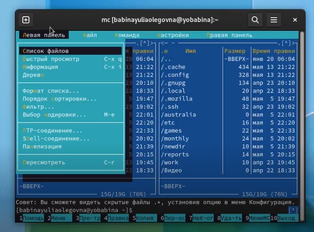

## Операции mc, связанные с управляющими клавишами 

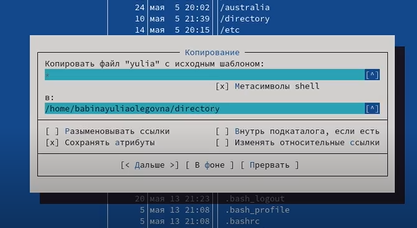

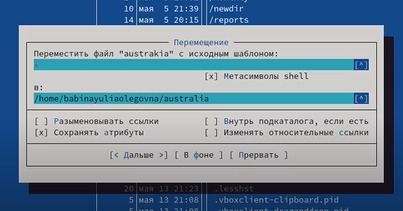

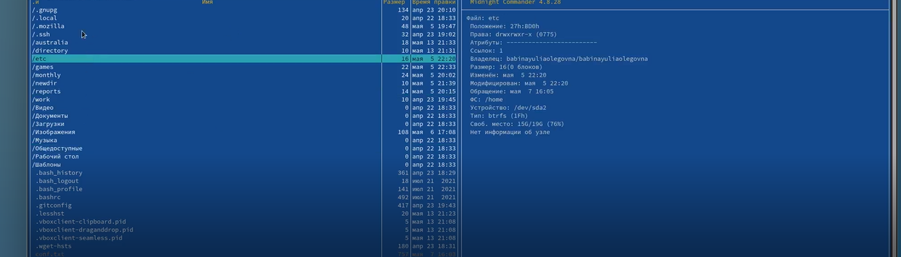

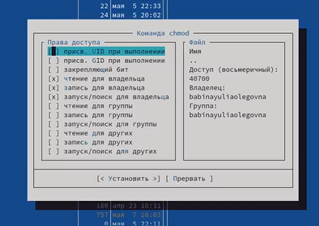

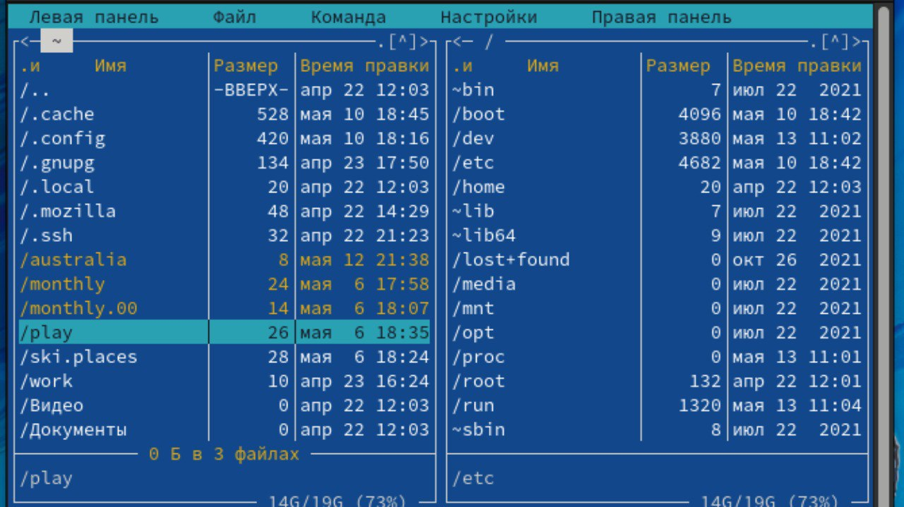

## Основные команды панелей

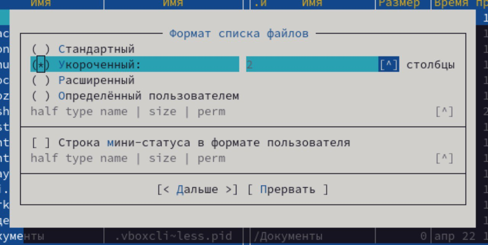

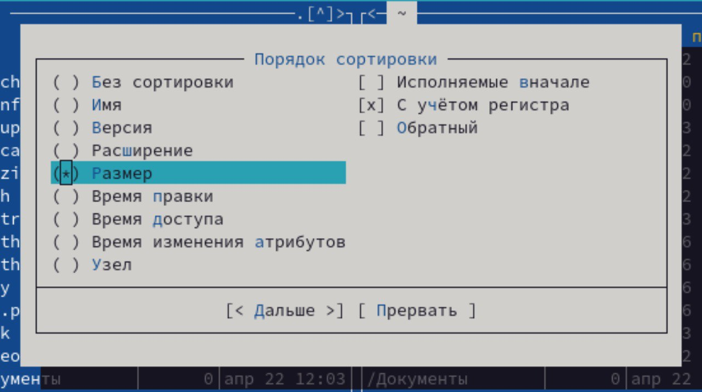

##  Работа с подменю "Файл"

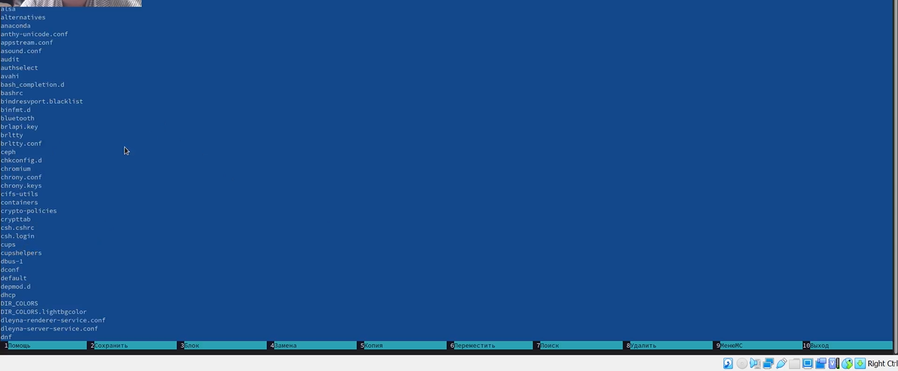

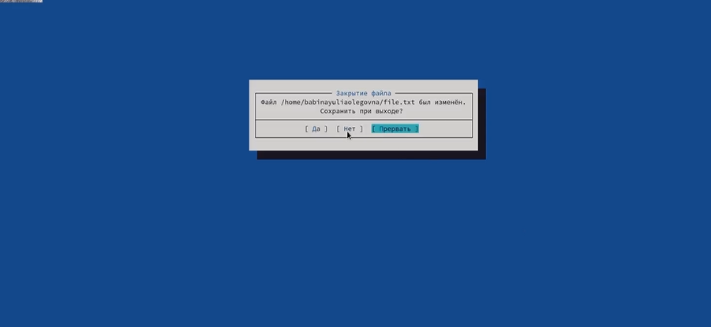

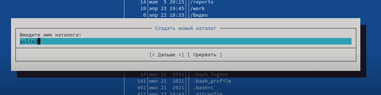

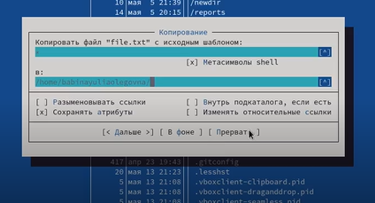

##  Работа с подменю "Команда"

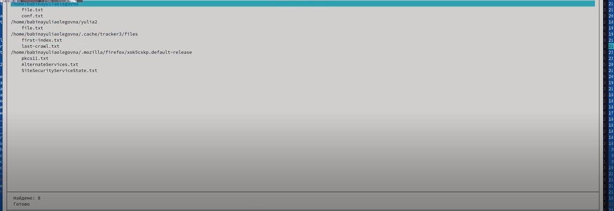

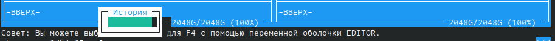

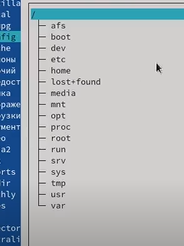

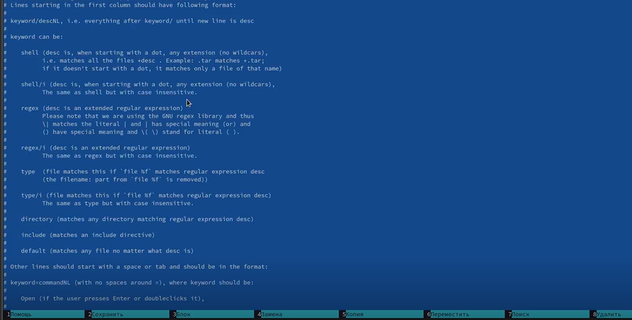

## Работа с подменю "Настройки"

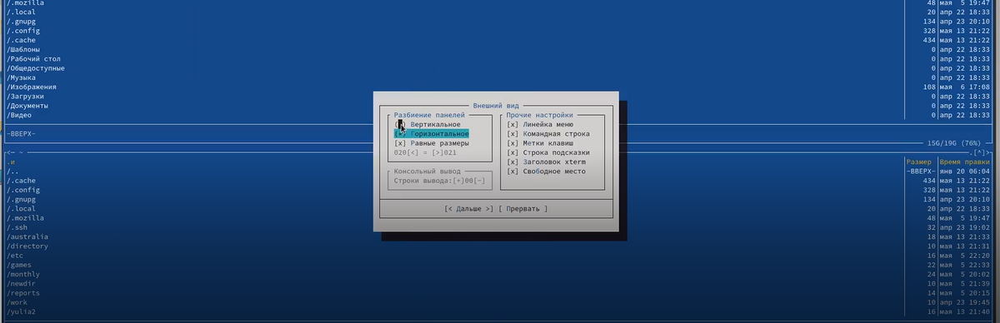

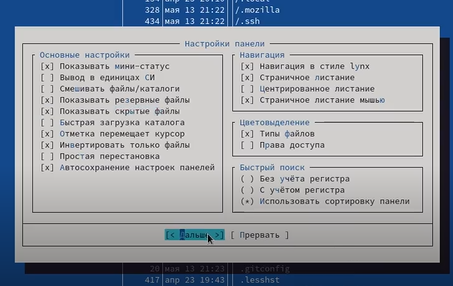

## Создание и работа с файлом 

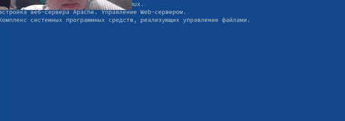

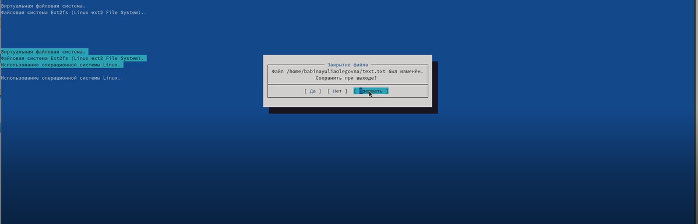

## Работа со скриптом 

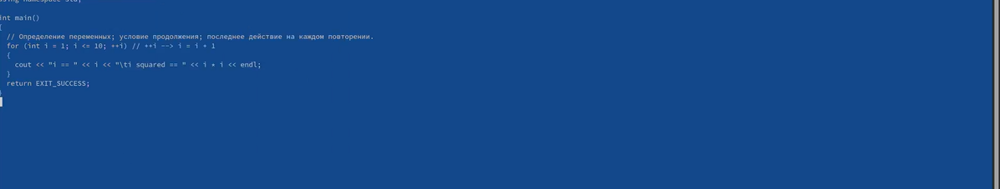

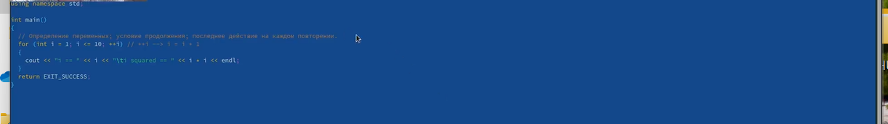

# Вывод
В ходе данной лабораторной работы я освоила основные возможности командной оболочки Midnight Commander. Приобрела навыки практической работы по просмотру каталогов и файлов; манипуляций
с ними.
