---
## Front matter
lang: ru-RU
title: Презентация к лабораторной работе №9
author: Бабина Ю.О.
group: НПМбд-01-21

## Formatting
toc: false
slide_level: 2
theme: metropolis
header-includes: 
 - \metroset{progressbar=frametitle,sectionpage=progressbar,numbering=fraction}
 - '\makeatletter'
 - '\beamer@ignorenonframefalse'
 - '\makeatother'
aspectratio: 43
section-titles: true
---

# Цель работы 

Познакомиться с операционной системой Linux. Получить практические навыки работы с редактором Emacs.

# Ход работы

## Работа с первым файлом в emacs.

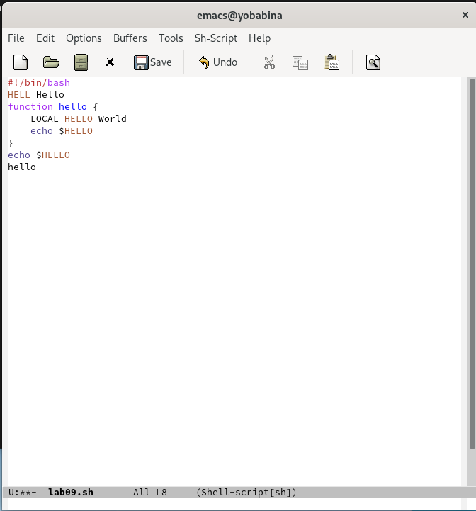

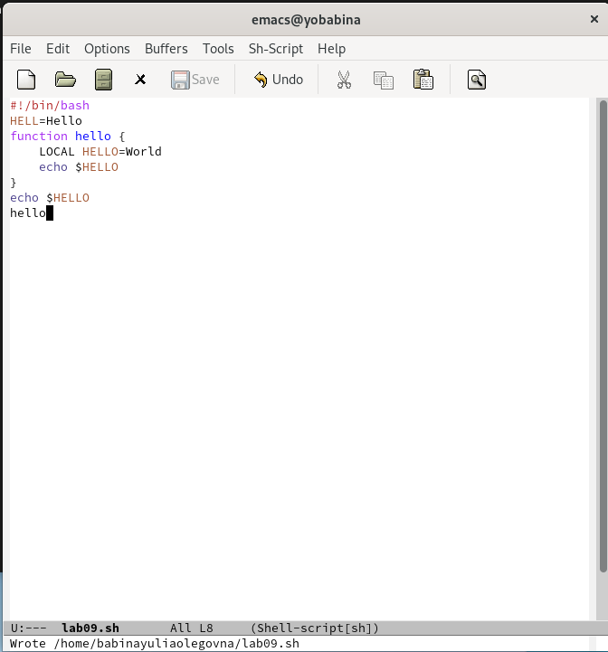

## Работа c текстом 

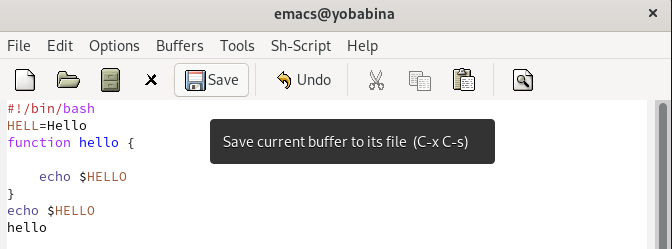

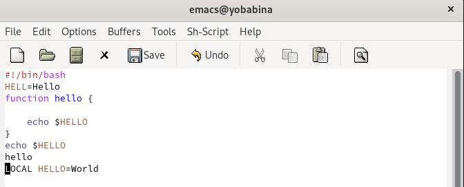

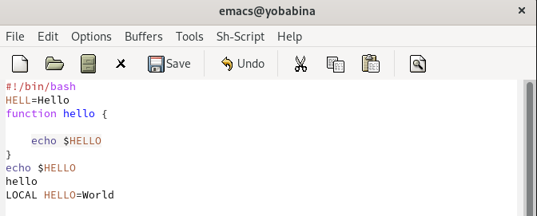

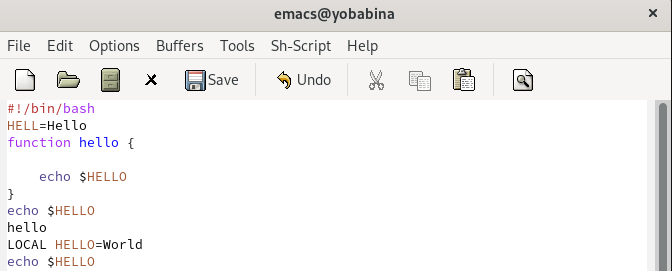

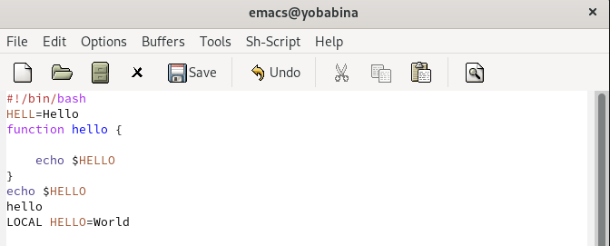

## Работа c курсором 

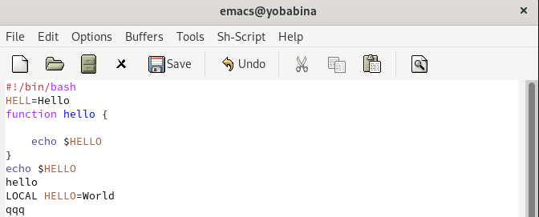

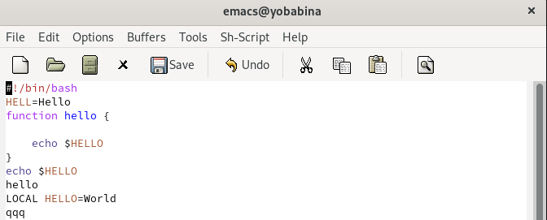

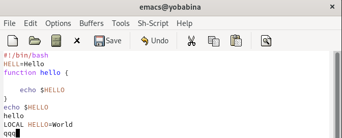

## Управление буферами
  
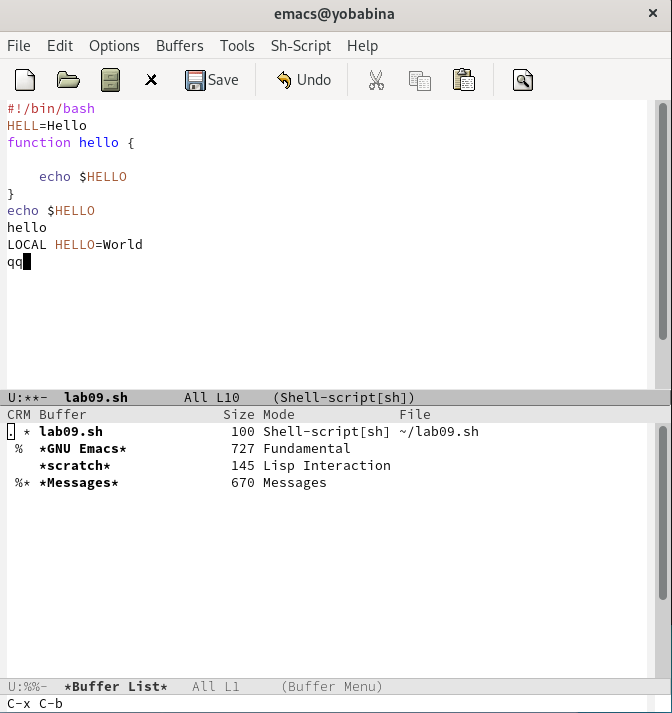

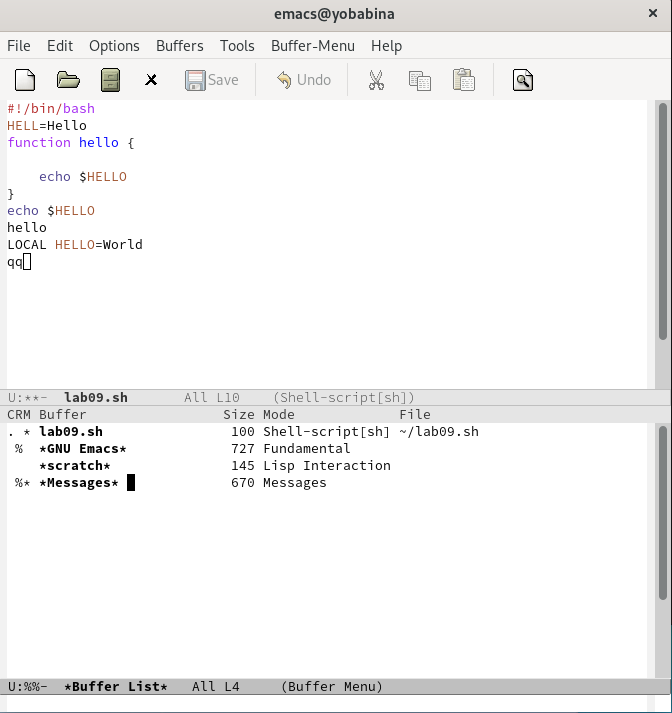

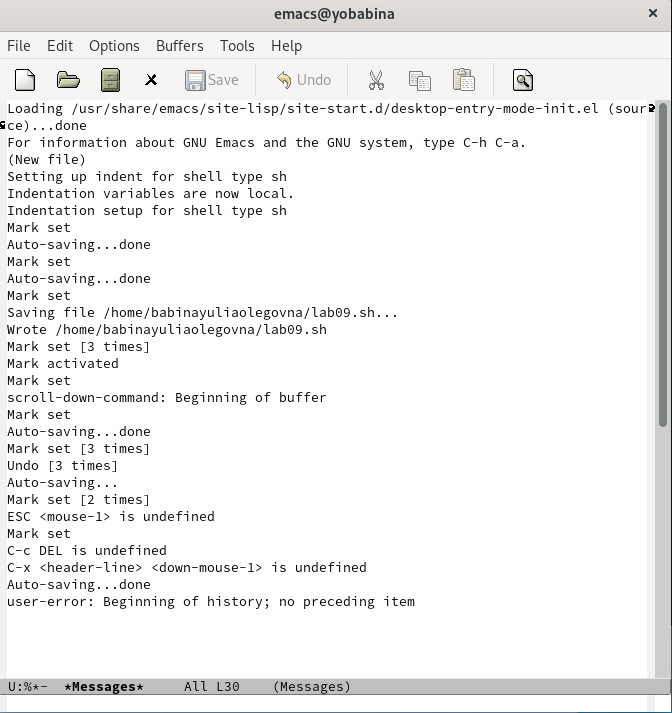

## Управление окнами

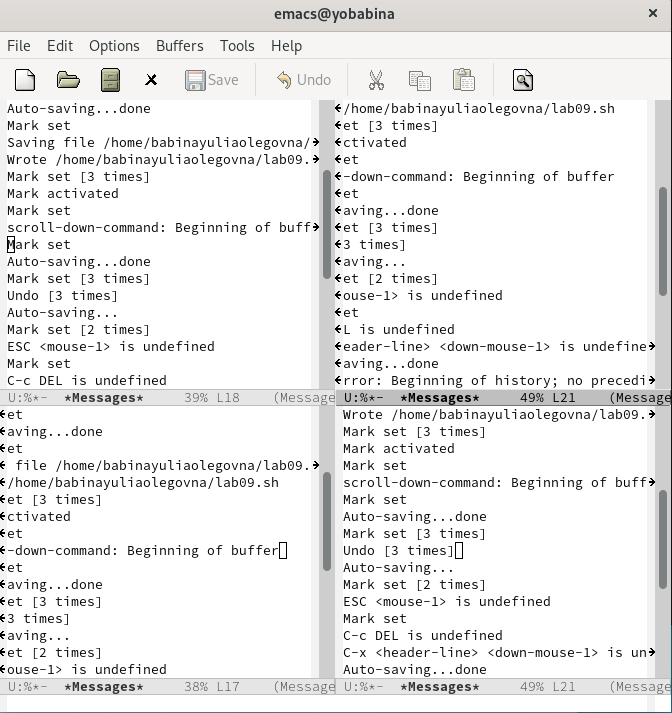

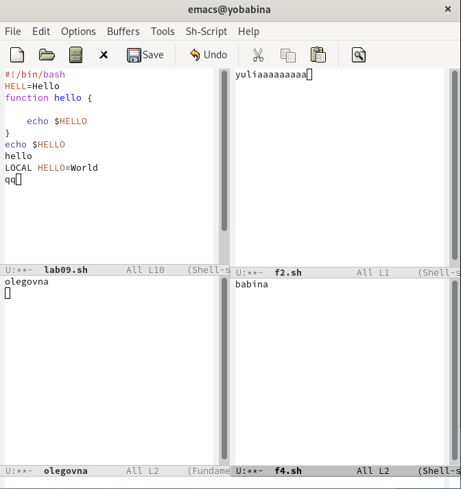

## Режим поиска

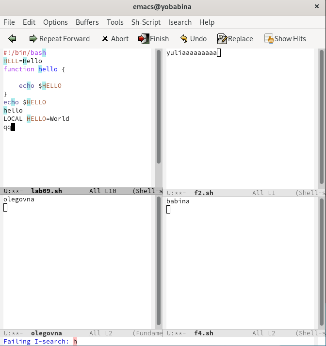

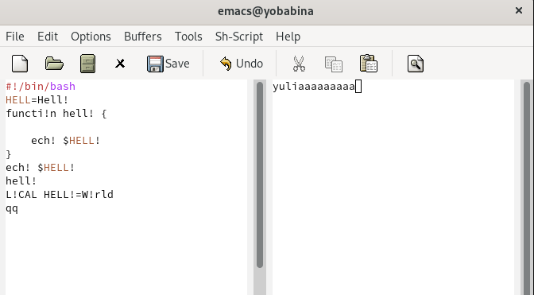

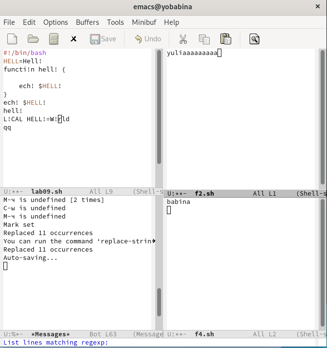

# Вывод
В ходе данной лабораторной работы я познакомилась с операционной системой Linux. Получила практические навыки работы с редактором Emacs.
