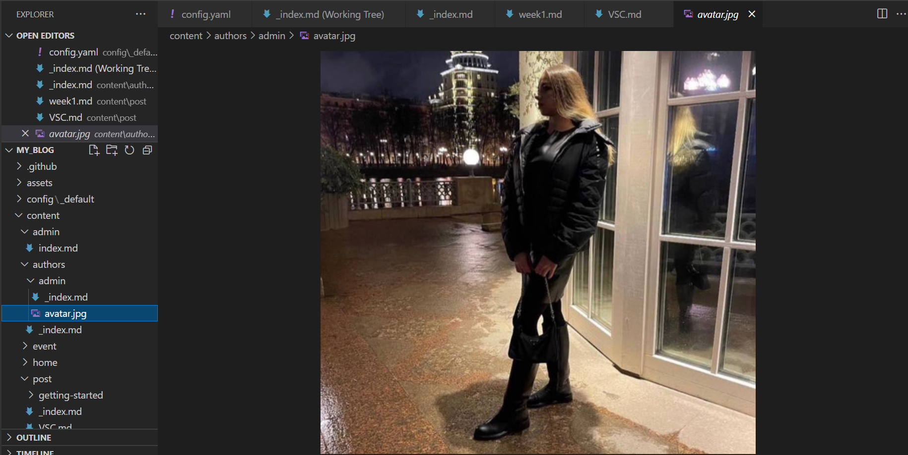
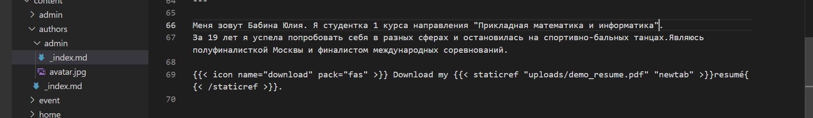
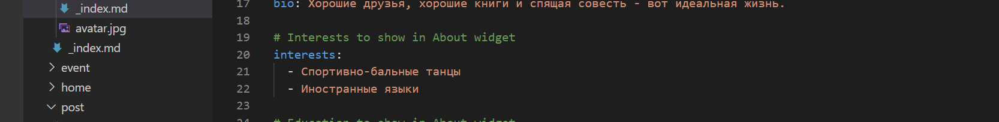
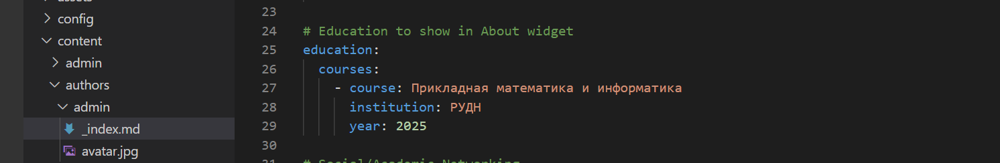
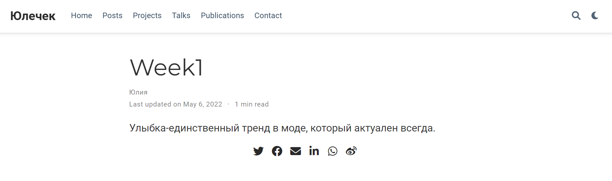
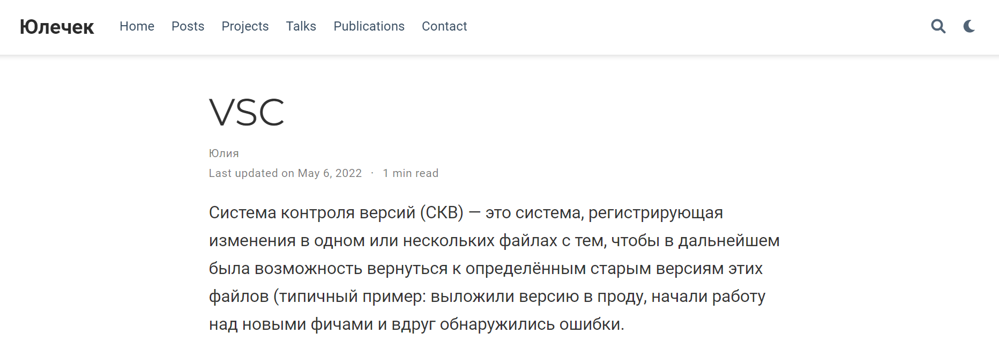

# **Отчет о выполнении индивидуального проекта (этап 2)*
## **Common information**
discipline: Операционные системы  
author: Бабина Юлия Олеговна  
group: НПМбд-01-21
---
---
---
## **Цель работы**
Добавить к сайту данные о себе. Сделать пост по прошедшей неделе. Добавить пост на тему: управление версиями. Git.
## **Ход работы**  

Разместим фотографию владельца сайта. Для изменения изображения нужно заменить изображение avatar.jpg на новое изображение с таким же названием и расширением. 

Добавим данные о себе, перейду по адресу   
     <ваш проект>\content\authors\admin\_index/md  
Разместим краткое описание (Biography).
Это можно заполнить в самом низу файла.

Добавим информацию об интересах (размещаются в разделе Interests).
 

Добавим информацию об образовании (размещается в разделе Education).

Сделаем пост по прошедшей неделе. Для этого воспользуемся следующей командой:      
hugo new post/<название поста с расширением md>
Данный файл будет иметь следующую разметку.

Заполним соответствующие поля и разместим текст в самом низу файла. По итогу наш пост имеет следующий вид (отображается в разделе Posts):

Аналогичным способом добавим пост об управлении версиями. 

## **Вывод**
В ходе выполнения данной работы я выполнила второй этап индивидуального проекта. 
