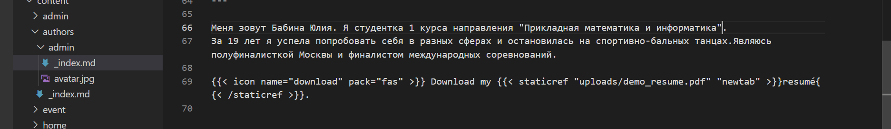
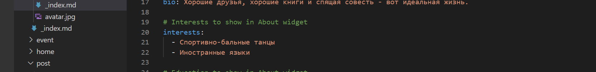
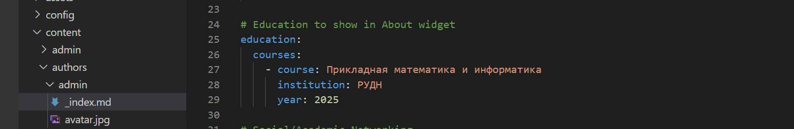
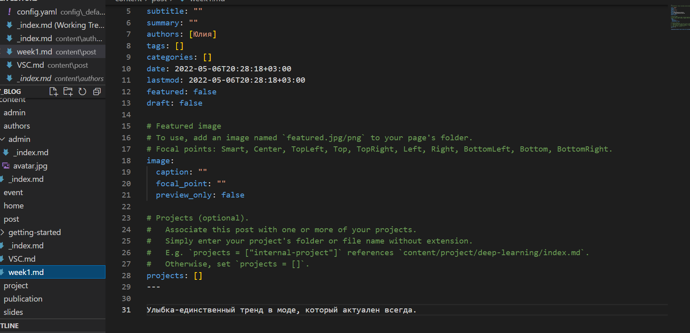
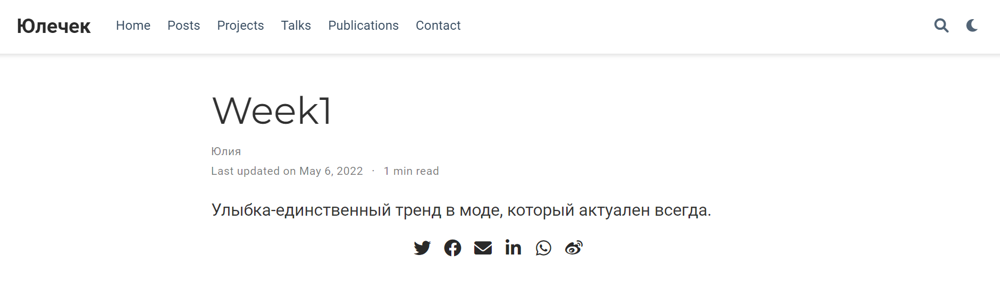
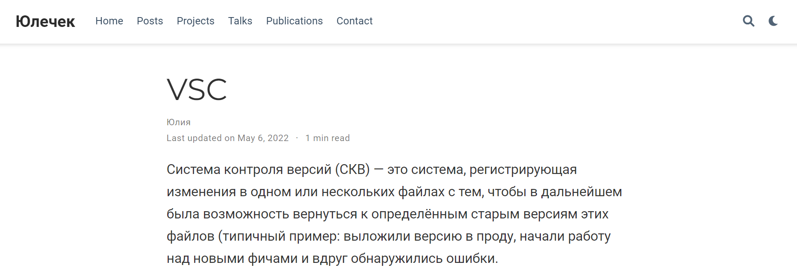

---
## Front matter
lang: ru-RU
title: Презентация к этапу 2 индивидуального проекта
author: Бабина Ю.О.
group: НПМбд-01-21

## Formatting
toc: false
slide_level: 2
theme: metropolis
header-includes: 
 - \metroset{progressbar=frametitle,sectionpage=progressbar,numbering=fraction}
 - '\makeatletter'
 - '\beamer@ignorenonframefalse'
 - '\makeatother'
aspectratio: 43
section-titles: true
---

# Цель работы 

Добавить к сайту данные о себе. Сделать пост по прошедшей неделе. Добавить пост на тему: управление версиями. Git.

# Ход работы

## Добавление данных о себе

<ваш проект>\content\authors\admin\_index/md 

Разместим фотографию владельца сайта. 

Разместим краткое описание (Biography).

Добавим информацию об интересах.
 

Добавим информацию об образовании.

## Создание и заполнение поста

Сделаем пост по прошедшей неделе. Для этого воспользуемся следующей командой:      
hugo new post/<название поста с расширением md>

Аналогичным способом добавим пост об управлении версиями. 

# Вывод
В рамках выполнения данной работы я выполнила второй этап индивидуального проекта. 