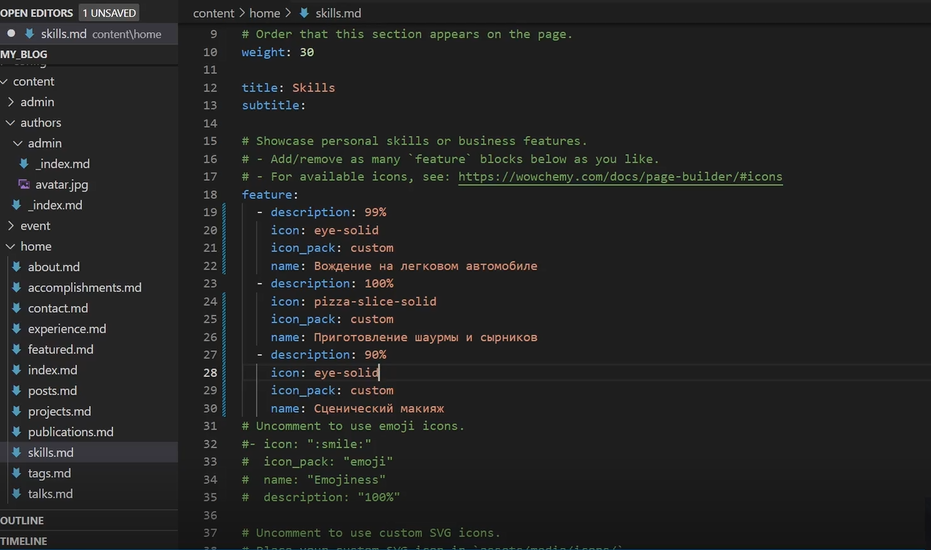
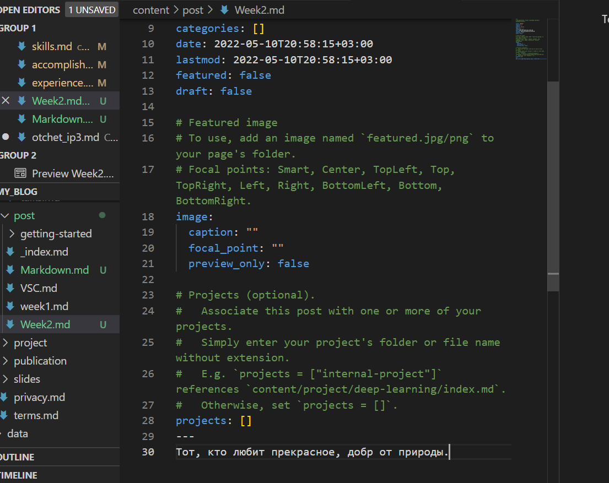
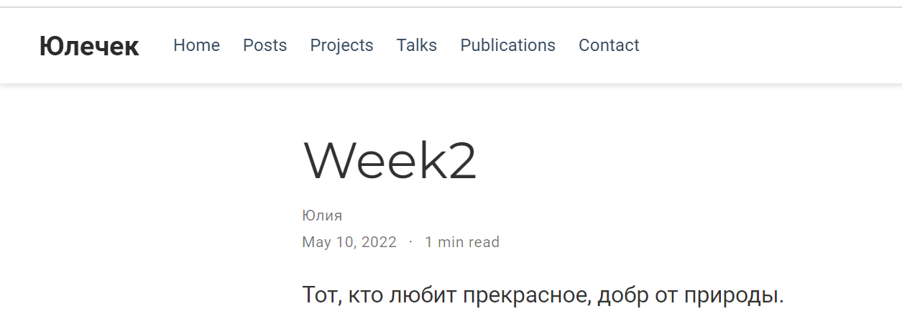
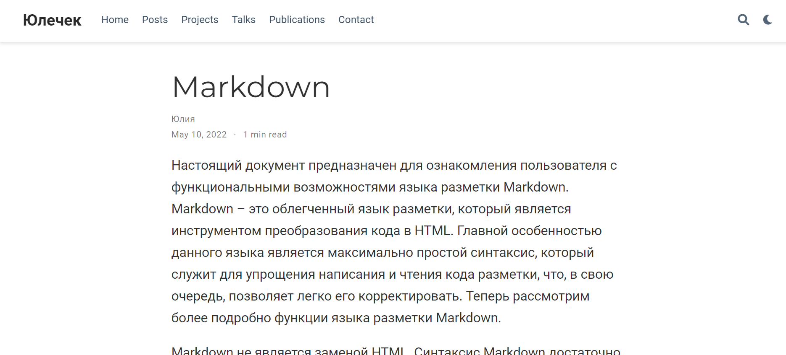

# **Отчет о выполнении индивидуального проекта (этап 3*
## **Common information**
discipline: Операционные системы  
author: Бабина Юлия Олеговна  
group: НПМбд-01-21
---
---
---
## **Цель работы**
Добавить к сайту достижения. Сделать пост по прошедшей неделе. Добавить пост на тему: язык разметки Markdown.
## **Ход работы**  

Добавим данные о себе, перейду по адресу   
     <ваш проект>\content\home\

Добавим информацию о навыках (Skills). Для этого нужно произвести изменения в файле skills.md.

Для того, чтобы изменить иконку нужно перейти по ссылке https://wowchemy.com/docs/page-builder/#icons , выбрать соответствующую иконку, скачать ее и переместить svg файл в <ваш проект>\assets\media\icons. При заполнении разметки в поле icon надо записать имя файла без раcширения, а в разделе icon_pack - custom.

icon: <имя svg файла>  
icon_pack: custom 

Добавим информацию об опыте (Experience). Для этого нужно произвести изменения в файле experience.md.
 

Добавим информацию о достижениях (Accomplishments). Для этого нужно произвести изменения в файле accomplishments.md.

Сделаем пост по прошедшей неделе. Для этого воспользуемся следующей командой:      
hugo new post/<название поста с расширением md>
Данный файл будет иметь следующую разметку.

Заполним соответствующие поля и разместим текст в самом низу файла. По итогу наш пост имеет следующий вид (отображается в разделе Posts):

Аналогичным способом добавим пост о языке разметки Markdown.

## **Вывод**
В ходе выполнения данной работы я выполнила третий этап индивидуального проекта. 
