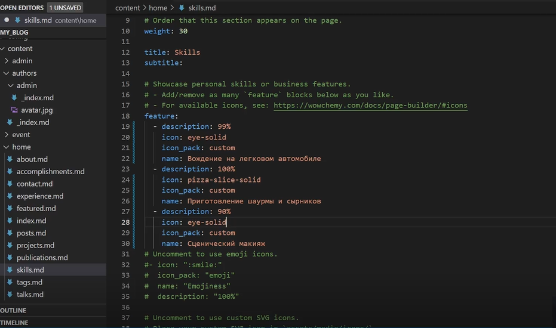
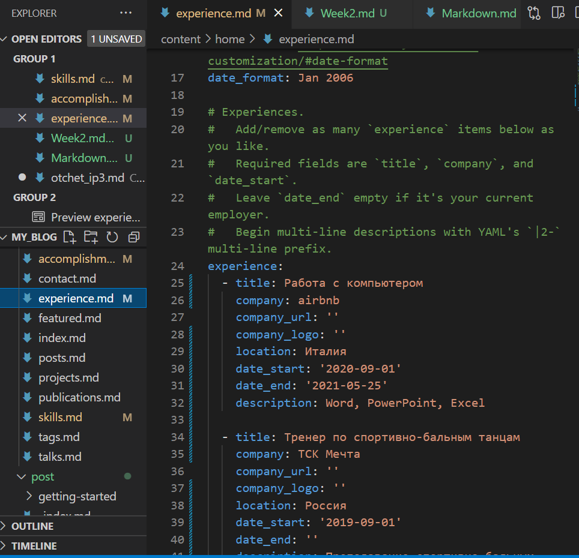
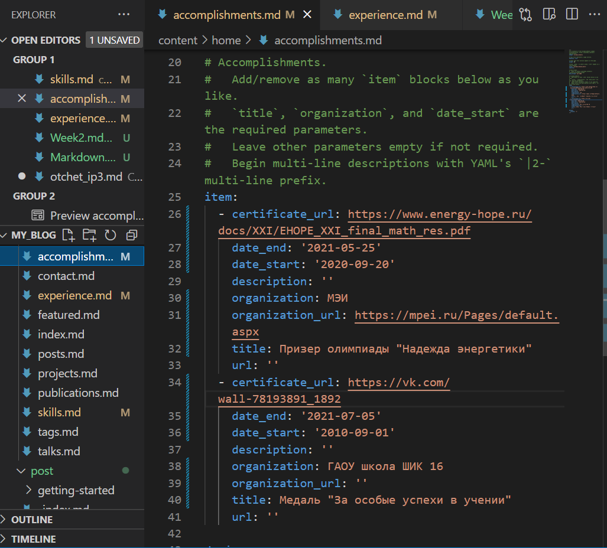
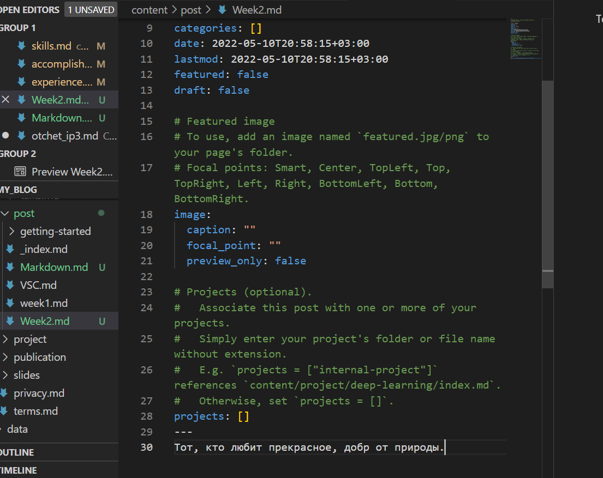
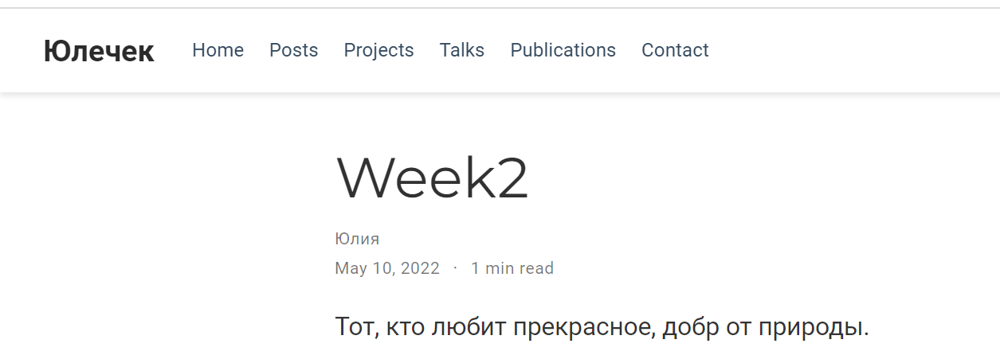
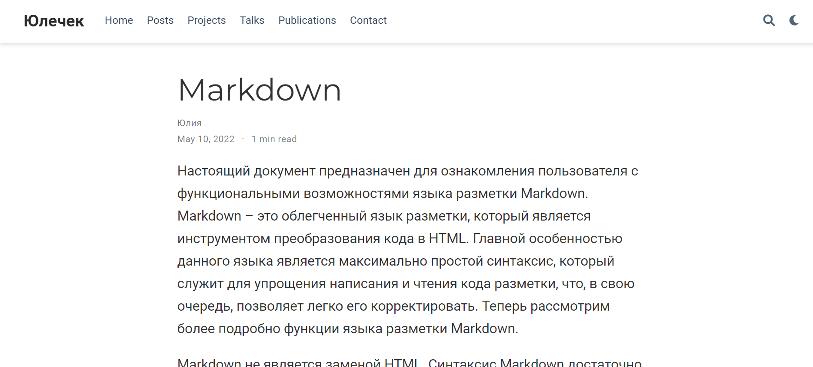

---
## Front matter
lang: ru-RU
title: Презентация к этапу 3 индивидуального проекта
author: Бабина Ю.О.
group: НПМбд-01-21

## Formatting
toc: false
slide_level: 2
theme: metropolis
header-includes: 
 - \metroset{progressbar=frametitle,sectionpage=progressbar,numbering=fraction}
 - '\makeatletter'
 - '\beamer@ignorenonframefalse'
 - '\makeatother'
aspectratio: 43
section-titles: true
---

# Цель работы 

Добавить к сайту достижения. Сделать пост по прошедшей неделе. Добавить пост на тему: язык разметки Markdown.

# Ход работы

## Добавление к сайту достижений.

<ваш проект>\content\home\

Добавим информацию о навыках (Skills). 

Добавим информацию об опыте (Experience).
 

Добавим информацию о достижениях (Accomplishments). 

## Создание и заполнение поста

Сделаем пост по прошедшей неделе. Для этого воспользуемся следующей командой:      
hugo new post/<название поста с расширением md>

Аналогичным способом добавим пост о языке разметки Markdown.

# Вывод
В ходе выполнения данной работы я выполнила третий этап индивидуального проекта. 
