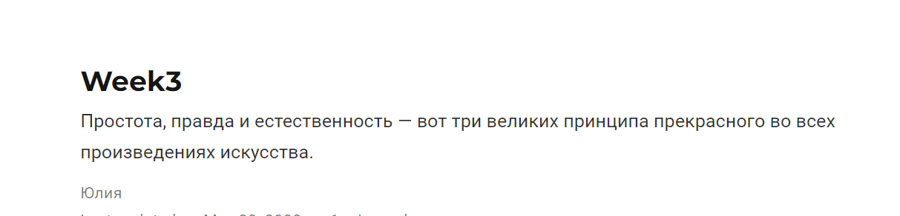

# **Отчет о выполнении индивидуального проекта (этап 4*
## **Common information**
discipline: Операционные системы  
author: Бабина Юлия Олеговна  
group: НПМбд-01-21
---
---
---
## **Цель работы**
Добавить к сайту ссылки на научные и библиометрические ресурсы. Сделать пост по прошедшей неделе. Добавить пост на тему: оформление отчёта.
## **Ход работы**  

Зарегистрируемся на соответствующих ресурсах и разместим на них ссылки на сайте, перейдя в файл с расположением 
     content\authors\admin\ _index.md

Изменения будем проводить в разделе Social. Каждая ссылка имеет 4 поля. Иконку можно записать в поле social, набор иконок - в iconpack (обычно fab или fas) и ссылку в поле - links.

Сделаем пост по прошедшей неделе. Для этого воспользуемся следующей командой:      
hugo new post/<название поста с расширением md>

Данный файл будет иметь следующую разметку.

Заполним соответствующие поля и разместим текст в самом низу файла. По итогу наш пост имеет следующий вид (отображается в разделе Posts):

Аналогичным способом добавим пост на тему: оформление отчета.

## **Вывод**
В ходе выполнения данной работы я выполнила четвертый этап индивидуального проекта. 
