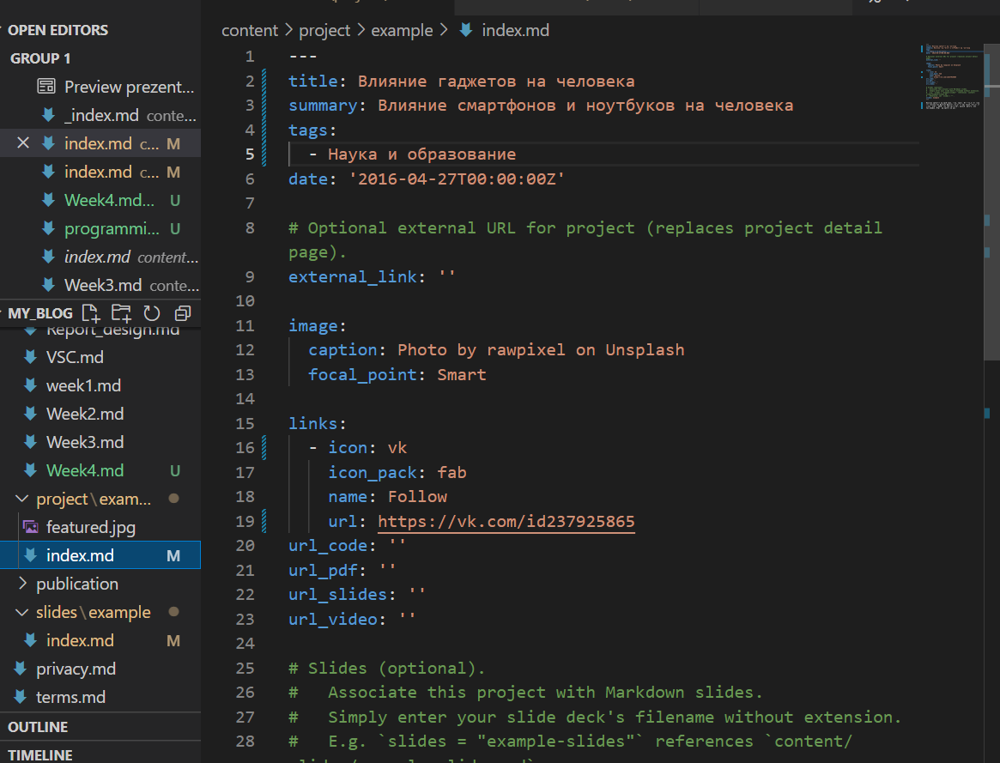
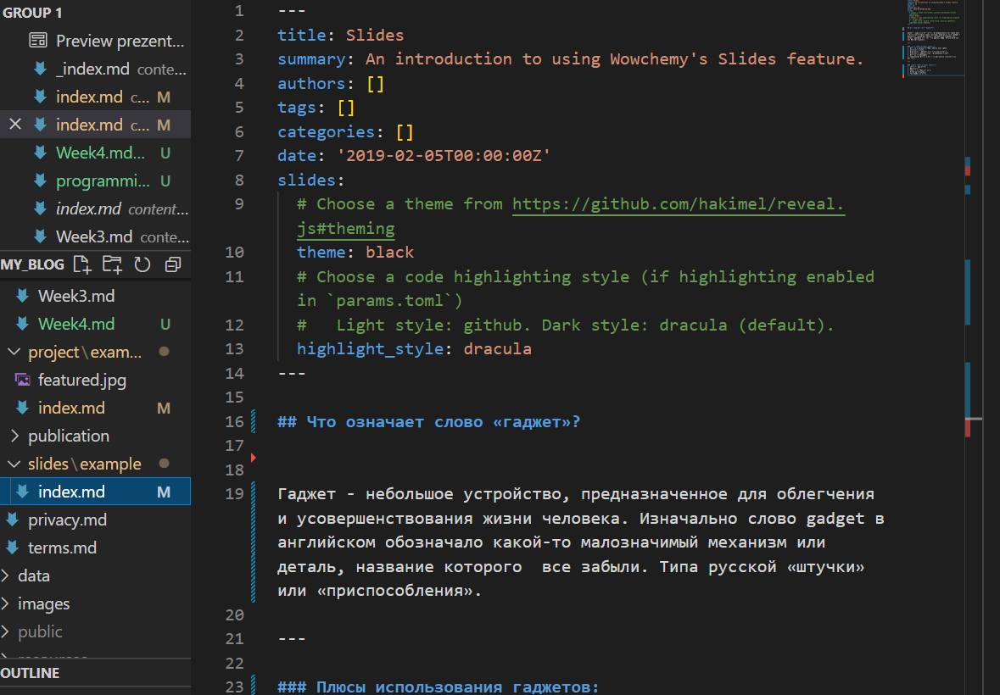
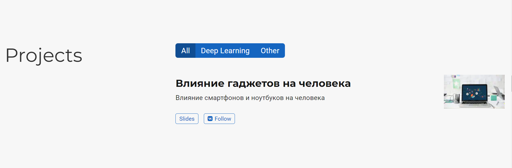
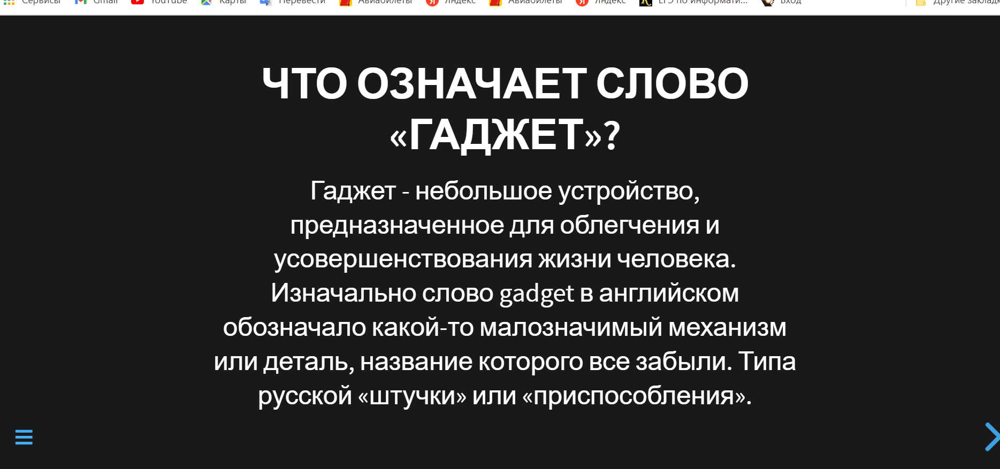
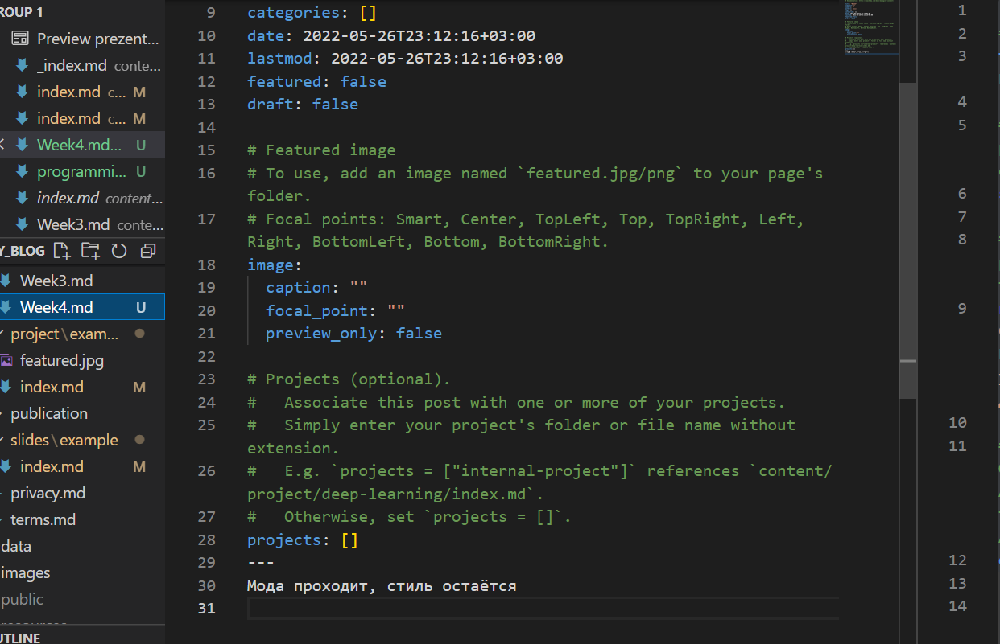
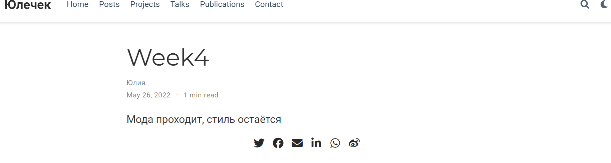
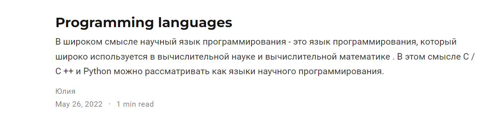

# **Отчет о выполнении индивидуального проекта (этап 5)*
## **Common information**
discipline: Операционные системы  
author: Бабина Юлия Олеговна  
group: НПМбд-01-21
---
---
---
## **Цель работы**
Добавить к сайту все остальные элементы. Сделать пост по прошедшей неделе. Добавить пост на тему: языки научного программирования.
## **Ход работы**  

Для редактирования информации о проектах перейдем по данному адресу:

```
<ваш проект>\content\project\example\index.md
```

Данный файл имеет следующую разметку.



Добавим презентацию в поле slides. Для ее отображения надо создать файл md с соответствующей разметкой и добавить его по данному относительному пути:
```
<ваш проект>\content\slides
```
 


Теперь раздел с проектами имеет следующий вид:






Сделаем пост по прошедшей неделе. Для этого воспользуемся следующей командой:  
```    
hugo new post/<название поста с расширением md>
```
Данный файл будет иметь следующую разметку.



Заполним соответствующие поля и разместим текст в самом низу файла. По итогу наш пост имеет следующий вид (отображается в разделе Posts):



Аналогичным способом добавим пост на тему: язык научного программирования.




## **Вывод**
В ходе выполнения данной работы я выполнила пятый этап индивидуального проекта. 
