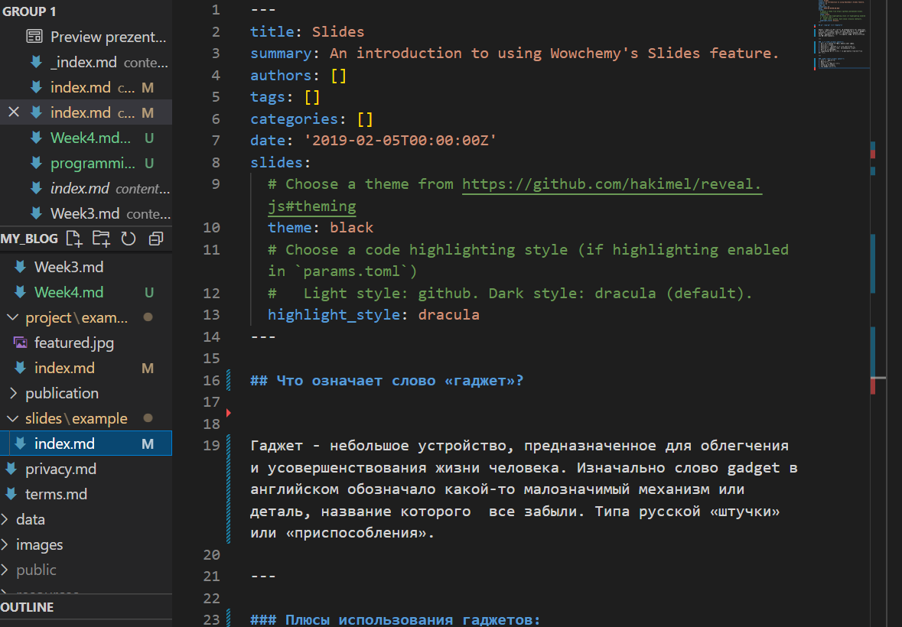
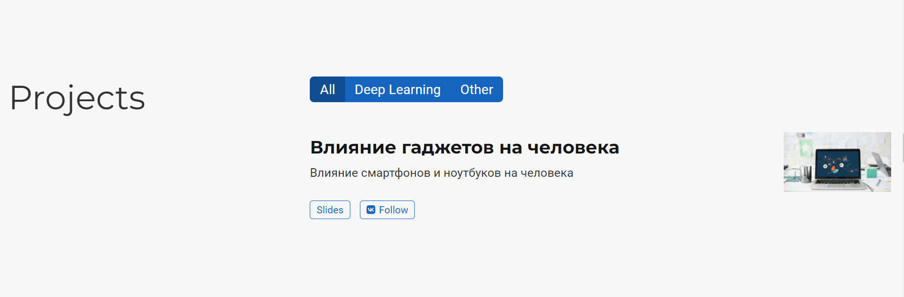

---
## Front matter
lang: ru-RU
title: Презентация к этапу 5 индивидуального проекта
author: Бабина Ю.О.
group: НПМбд-01-21

## Formatting
toc: false
slide_level: 2
theme: metropolis
header-includes: 
 - \metroset{progressbar=frametitle,sectionpage=progressbar,numbering=fraction}
 - '\makeatletter'
 - '\beamer@ignorenonframefalse'
 - '\makeatother'
aspectratio: 43
section-titles: true
---

# Цель работы 

Добавить к сайту все остальные элементы. Сделать пост по прошедшей неделе. Добавить пост на тему: языки научного программирования.

# Ход работы

## Работа с разделом "Projects"


 





## Создание поста

Сделаем пост по прошедшей неделе. Для этого воспользуемся следующей командой:  
```    
hugo new post/<название поста с расширением md>
```


Аналогичным способом добавим пост на тему: язык научного программирования.


# Вывод
В ходе выполнения данной работы я выполнила пятый этап индивидуального проекта. 
