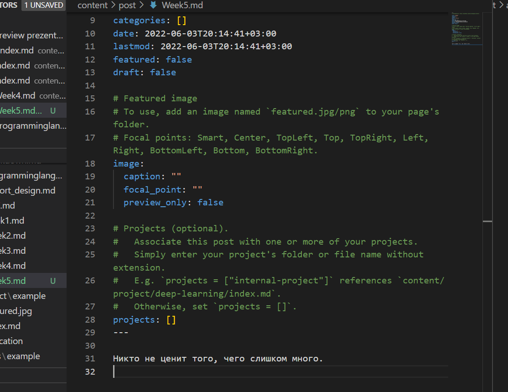
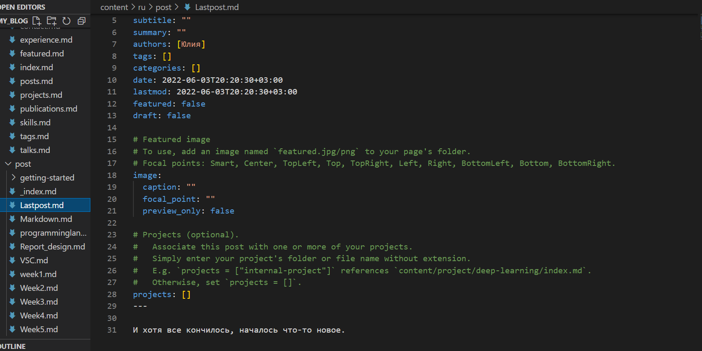
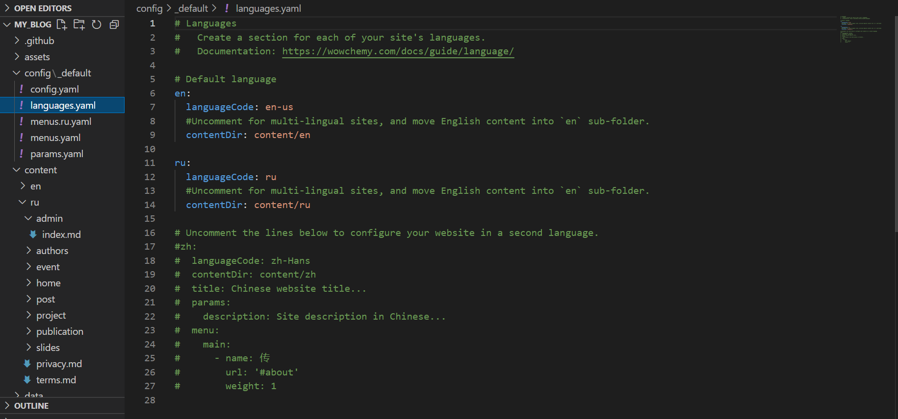
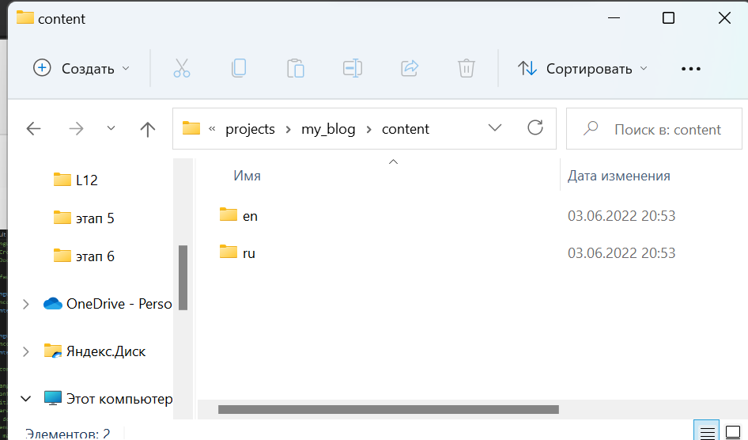
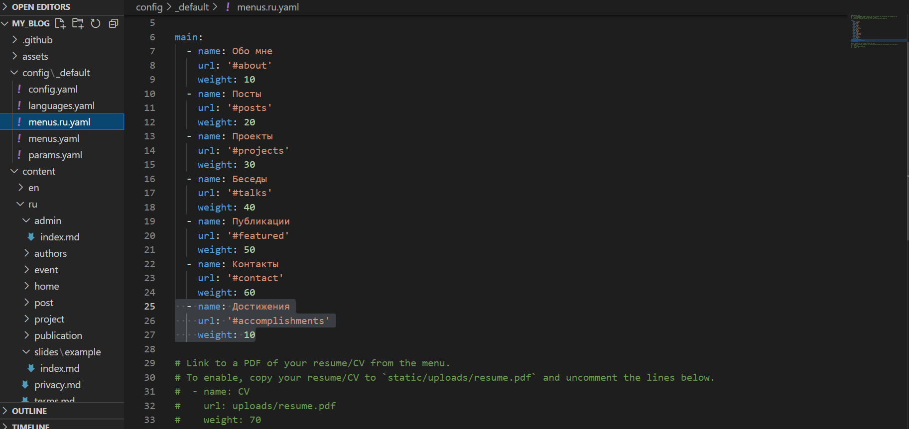

# **Отчет о выполнении индивидуального проекта (этап 6)*
## **Common information**
discipline: Операционные системы  
author: Бабина Юлия Олеговна  
group: НПМбд-01-21
---
---
---
## **Цель работы**
- Сделать поддержку английского и русского языков.
- Разместить элементы сайта на обоих языках.
- Разместить контент на обоих языках.
- Сделать пост по прошедшей неделе.
- Добавить пост на тему по выбору (на двух языках).
## **Ход работы**  

Сделаем пост по прошедшей неделе. Для этого воспользуемся следующей командой:  
```    
hugo new post/<название поста с расширением md>
```
Данный файл будет иметь следующую разметку.



Заполним соответствующие поля и разместим текст в самом низу файла. По итогу наш пост имеет следующий вид (отображается в разделе Posts):


Аналогичным способом добавим пост на тему: последний пост.



Затем перейдем к двухъязычной поддержке сайта. Для этого произведем изменения в файле languages.yaml в папке config.  



В данномм файле в аоле contentDir мы прописали путь до папки с контентом на соответствующем языке, поэтому в папке content необходимо создать папку с названием, являющимся кодировкой языка и перенесем все содержимое туда.



По итогу у нас должно получиться две папки с одинаковым файловым содержимым.

После чего остается перевести контент на новый язык.

Также стоит отметить, что можно изменить меню в шапке сайта, для этого необходимо создать файл menus.<кодировка>.yaml и изменить соответствующие поля. 



По окончании работы наш сайт имеет следующий вид: 
[ссылка на сайт](https://heartfelt-cajeta-b460c7.netlify.app/)

## **Вывод**
В ходе выполнения данной работы я выполнила шестой этап индивидуального проекта. 
