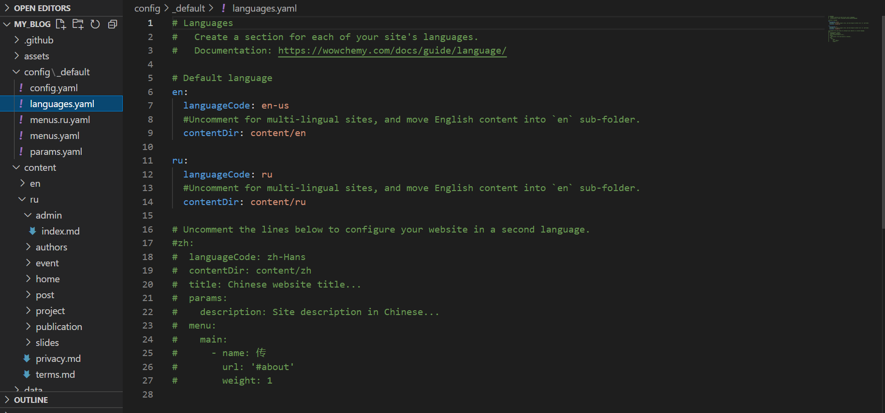
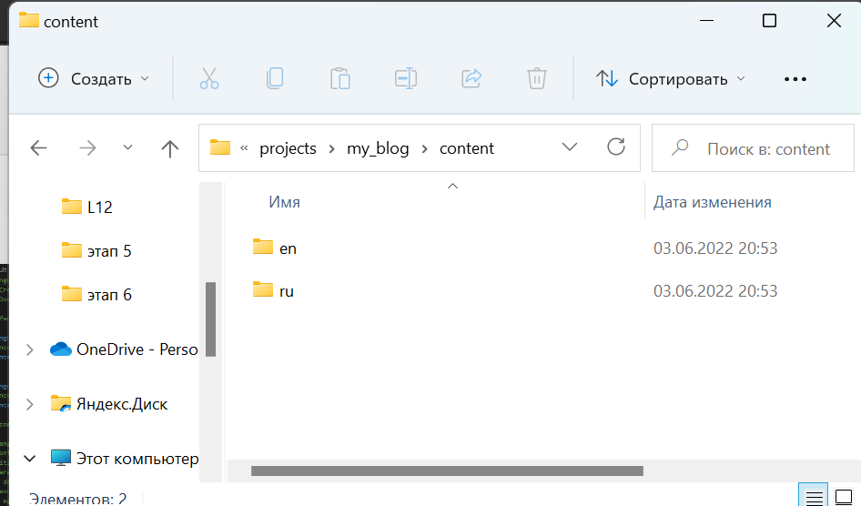
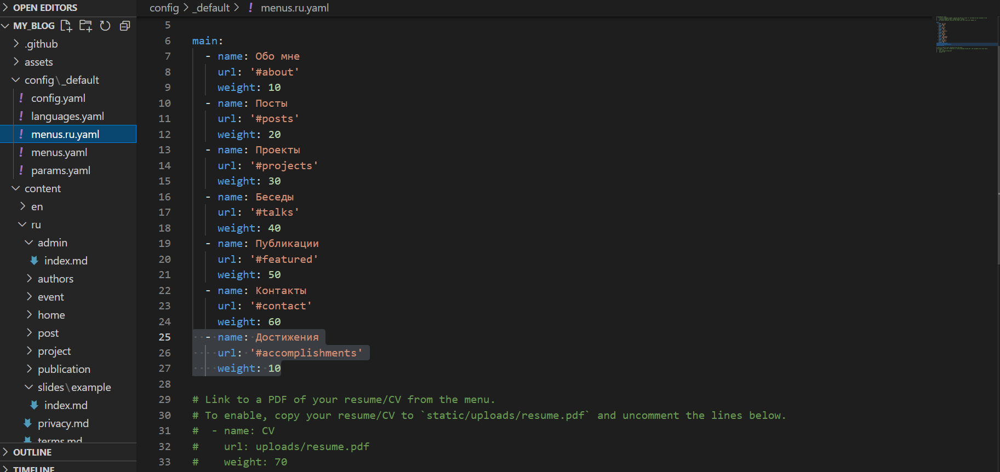

---
## Front matter
lang: ru-RU
title: Презентация к этапу 6 индивидуального проекта
author: Бабина Ю.О.
group: НПМбд-01-21

## Formatting
toc: false
slide_level: 2
theme: metropolis
header-includes: 
 - \metroset{progressbar=frametitle,sectionpage=progressbar,numbering=fraction}
 - '\makeatletter'
 - '\beamer@ignorenonframefalse'
 - '\makeatother'
aspectratio: 43
section-titles: true
---

# Цель работы 

- Сделать поддержку английского и русского языков.
- Разместить элементы сайта на обоих языках.
- Разместить контент на обоих языках.
- Сделать пост по прошедшей неделе.
- Добавить пост на тему по выбору (на двух языках).

# Ход работы

## Изменения в файле languages.yaml



## Изменения в папке content



## Перевод меню



## Итоговый вид сайта 

[ссылка на сайт](https://heartfelt-cajeta-b460c7.netlify.app/)

## Создание поста

Сделаем пост по прошедшей неделе. Для этого воспользуемся следующей командой:  
```    
hugo new post/<название поста с расширением md>
```


Аналогичным способом добавим пост на тему: последний пост.


# Вывод
В ходе выполнения данной работы я выполнила шестой этап индивидуального проекта. 
